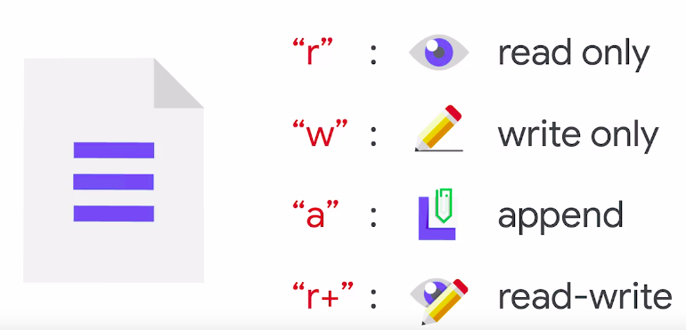
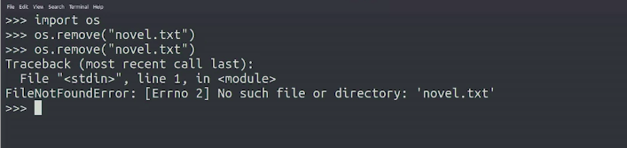
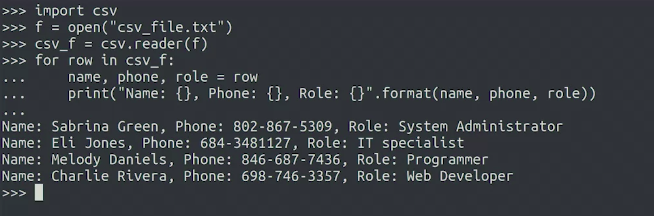
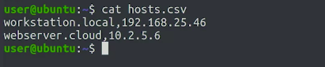
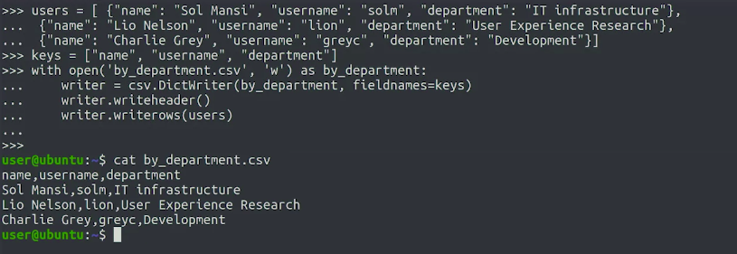

Using Python to Interact with the Operating System
==================================================

by Google

# Module 2
#
## Title: Managing Files with Python

## Reading and Writing Files

### Programming with Files

> Operating Systems like Mac OS, Windows, and Linux use file systems to organize and control how data is stored and access
#
> Data is usually stored on a disk and saved in files which are held in containers called directories or folders
#
> File systems are usually organized in a tree structure with directories and files nested under their parents

* As an IT specialist, it's likely that you'll need to manipulate files and directories on a computer a lot
* When you need to work on a large number of files and directories, that's when automation can be a huge help
* As a sysadmin, we interact with files and directories all the time, sometimes even if we have no intention of modifying them
* __Operating Systems__ like Mac OS, Windows, and Linux use __file systems__ to organize and control how data is stored and access
	* Data is usually stored on a disk and saved in files which are held in containers called __directories__ or __folders__
	* __File systems__ are usually organized in a __tree structure__ with __directories__ and __files__ nested under their __parents__
* An __absolute path__ is a full path to the resource in the file system
	* We know where a resource like a directory or a file is located within that tree structure by its __path__
	* For example
		1. On a __Windows__ computer, the absolute path to the folder for the user Jordan would be `C:\Users\Jordan`
		1. On a __Linux__ computer, the absolute path to the equivalent directory would be `/home/jordan`
	* We call it absolute path because it doesn't matter where in the file system our script is running, the absolute path will always lead us to the resource
* __Relative Paths__ use only a portion of a path to show where the resource is located in relation to the current working directory
	* Relative paths are a shortcut that you can use so you don't have to write out the full file path
	* But keep in mind, they only makes sense relative to the current location
	* For Example
		* if we list the contents of the directory examples, we'll get different outputs depending on what the current directory is
			1. if our current directory is `/home/jordan`, we'll get the contents of `/home/jordan/examples`
			1. if the current directory is `/user/share/doc/python3`, we'll get the contents of `/user/share/doc/python3/examples`

### Reading Files

* When processing large chunks of data, it's a good idea to read that data from files
* Most programming languages have the ability to work with files baked into the core set of features
	* It gives us file objects which we can use to read and write to files
	* When we open a file, like we're doing in example below, the __Operating System__ checks that we have __permissions__ to access that file and then gives our code a __file descriptor__
		```python
		>>> file = open('spider.txt') # we're assuming the file we want to read is in the same directory as a script we're running
		>>> 						  # but we can just as easily pass an absolute paths to open a file in a different directory
		>>> 
		>>> print(file.readline())
		```
		<p align="center">
		  <a href="javascript:void(0)" rel="noopener">
			 </a>
		</p>
* __File Descriptor__
	* __File Descriptor__ is a token generated by the OS that allows programs to do more operations with the file
	* In Python, this __file descriptor__ is stored as an attribute of the __files object__
	* The __file object__ gives us a bunch of methods that we can use to operate with the file
		* with this __file object__, we can read the contents of the file and print them to the screen.
* Methods of File
	* __readline()__ method - It lets us read a single line of a file
		* Everytime it is executed, it reads the next line of the file
			* each time we call the readline method, the file object updates the current position in the file
			* So it keeps moving forward
				```python
				>>> file = open('spider.txt') # we're assuming the file we want to read is in the same directory as a script we're running
				>>> 						  # but we can just as easily pass an absolute paths to open a file in a different directory
				>>> 
				>>> print(file.readline())
				```
				<p align="center">
				  <a href="javascript:void(0)" rel="noopener">
					 </a>
				</p>
	* __read()__ method
		* __read()__ method reads from the current position until the end of the file instead of just one line
			* Just like readline, the read method starts reading from wherever we currently are in the file. But instead of just one line, it reads all the way through to the files end
				```python
				>>> file = open('spider.txt') # we're assuming the file we want to read is in the same directory as a script we're running
				>>> 						  # but we can just as easily pass an absolute paths to open a file in a different directory
				>>> 
				>>> print(file.read())
				```
				<p align="center">
				  <a href="javascript:void(0)" rel="noopener">
					 </a>
				</p>
	* __close()__ method
		* We close the file using the close method
		* This open-use-close pattern is a typical way of working with files in most programming languages
		* It's a good idea to close files after you've opened them for a few reasons
			1. First, when a file is opening your script, your file system usually lock it down and so no other programs or scripts can use it until you're finished
			1. Second, there's a limited number of file descriptors that you can create before your file system runs out of them
				* Although this number might be high, it's possible to open a lot of files and deplete your file system resources
				* This can happen if we're opening files in a loop
			1. Third, leaving open files hanging around can lead to race conditions which occur when multiple processes try to modify and read from one resource at the same time and can cause all sorts of unexpected behavior
				* No one wins in a race condition
					```python
					>>> file = open('spider.txt') # we're assuming the file we want to read is in the same directory as a script we're running
					>>> 						  # but we can just as easily pass an absolute paths to open a file in a different directory
					>>> 
					>>> print(file.close())
					```
* __with__ block with File
	* The __with__ keyword lets us create a block of code with the work we'd want to do with the file inside of it
	* In this case, we want to take a line of data from the file and print it to the screen, which is what print file readline does
	* When we use a "with" block, Python will automatically close the file
		* So we don't need to remember to do that ourselves
			```python
			>>> with open('spider.txt') as file:
			>>> 	print(file.readline())
			>>>
			```
			<p align="center">
			  <a href="javascript:void(0)" rel="noopener">
				 </a>
			</p>
* Both the __open-use-close approach__ and the __with__ approach have their __advantages__
	1. Using a __with__ block is a good way to open and work on a single file then have the file automatically closed at the end of the block
	1. On the flip side, using open outside of a block means we can use a file object in other places in our code
		* So we're not restricted to just one single block
		* But when taking this approach, we need to remember to close it when we're finished
* What is the __difference__ between the __readline()__ and __read()__ methods?
	* The __readline()__ method reads a single line from the current position
	* The __read()__ method reads from the current position until the end of the file

### Iterating through Files

* File objects can be iterated in the same way as other Python sequences like list or strings
	* This is really useful when you want to process a file line by line
	* for example you want to make a whole line uppercase before printing it
		```python
		>>> with open('spider.txt') as file:
		>>> 	for line in file:
		>>> 		print(line.upper())
		```
		<p align="center">
		  <a href="javascript:void(0)" rel="noopener">
			 </a>
		</p>
	* When Python reads the file line by line, the line variable will always have a new line character at the end
		* In other words, the newline character is not removed when calling read line
		* When we ask Python to print the line, the print function adds another new line character, creating an empty line
		* We can use a string method, __strip()__ to remove all surrounding white space, including __tabs__ and __new lines__
			```python
			>>> with open('spider.txt') as file:
			>>> 	for line in file:
			>>> 		print(line.strip().upper())
			```
			<p align="center">
			  <a href="javascript:void(0)" rel="noopener">
				 </a>
			</p>
* Another way we can work with the contents of the file is to read the file lines into a __list__
	* Then, we can do something with the lists like sort contents
		```python
		>>> file = open('spider.txt')
		>>> lines = file.readlines()
		>>> file.close()
		>>> 
		```
	* Even though the file object is now closed, the lines variable has the list of lines in the file, so we can operate on it
	* For example, let's sort it and print it
		```python
		>>> file = open('spider.txt')
		>>> lines = file.readlines()
		>>> file.close()
		>>>
		>>> lines.sort()
		>>> print(lines) 
		```
		<p align="center">
		  <a href="javascript:void(0)" rel="noopener">
			 </a>
		</p>
	* There are two things to check out on this code
		1. First, the lines have been sorted alphabetically, so they're no longer in the order that they were in the file
		1. Second, we can see that Python displays a newline character using "\n" symbol when printing a list of strings
			* This is a way of explicitly showing that there's a new line character in those strings
* Escape Sequence
	* In general, to display a character that's not printable, Python uses escape sequences with backslash, like `\n`
	* Another common escape sequence is `\t`, for tab
	* We can also use it for escaping quotes, if we have a string that contains either a single or double quote
* __CAUTION__
	* Methods like read or readlines that read the whole file at once are useful, but we should be careful when reading the entire contents of a file into a variable of our programs
		* If the file is super large, it can take a lot of our computer's memory to hold it, which can lead to poor performance
	* For __large files__, like the big log file of hundreds and hundreds of megabytes of data, it's more efficient to process it __line by line__

### Writing Files

* Syntax to write files
	* We're using the __with__ block pattern to open a file called novel.txt
	* Using the __write()__ method on a file object writes contents to it instead of reading from it
		```python
		>>> with open('novel.txt', 'w') as file:
		>>> 	file.write('It was a dark and stormy night')
		>>>
			30
		```
	* The second argument to the open method is 'w'
		* File objects can be opened in several different modes
		* A mode is similar to a file permission
			* It governs what you can do with the file you've just opened
		* By default, the open function uses the __r__ mode, which stands for __read only__
		* You get an error if you try to write to a file opened in read only mode
		* Since read only is the default, we don't have to pass the R as a second argument when we just want to read the file
		* The __w__ character tells the open function that we want to open the file for writing only
			* If the file doesn't exist then Python will create it
			* If the file does exist, then its current contents will be overwritten by whatever we decide to write using our scripts
		* It's important to remember that when opening a file in write only mode, you can't read its contents
			* If you try to, the interpreter raises an error
		* If you want to add content to a file that already exist, you can do that by using other modes like
			1. __a__ for __appending__ content at the end of an existing file
			1. __r+__ for __read-write__ mode, where you can both read contents and overwrite it
				<p align="center">
				  <a href="javascript:void(0)" rel="noopener">
					 </a>
				</p>
		* If you open a file for writing and the file already exists, the old contents will be deleted as soon as the file is opened
		* __Remember__, double check that you're opening the right file using the right mode
	* What is '30' at the end of our code?
		* That's return value of the write method. When successful, this method returns the number of characters that it wrote
			* So in this case, 30
	* Other Modes for File operation
		|Character|Meaning|
		|:---:|:---:|
		|'r'|open for reading (default)|
		|'w'|open for writing, truncating the file first|
		|'x'|open for exclusive creation, failing if the file already exists|
		|'a'|open for writing, appending to the end of the file if it exists|
		|'b'|binary mode|
		|'t'|text mode (default)|
		|'+'|open for updating (reading and writing)|

## Managing Files and Directories

### Working with Files

* Other operations on files can be
	1. delete
	1. rename
	1. move
	1. information about the file like
		1. the time it was last modified
		1. current size
* For operations mentioned above, we'll be using functions provided by the __OS module__
	* This module provides a layer of abstraction between Python and the operating system
	* It allows us to interact with the underlying system without us knowing whether we're working on a Windows, Mac, Linux, or any other operating system supported by Python
	* This means that you can write and test a script on one operating system like Windows and then run it on a different operating system like Linux
* __NOTE__
	* Paths can be different across different operating systems
		* So whenever we're using an absolute path in our code, we need to make sure we can provide alternatives for the platforms we want to support
* The OS module lets us do pretty much all the same tasks that we can normally do when working with files from the command line
	* We can change the file permissions and delete or rename files through our code
* __delete file__
	* To delete a file, we can use the, __remove()__ function from the __OS module__
		```python
		>>> import os
		>>> os.remove('novel.txt')
		>>>
		```
	* Let's see what happens if we try to remove it again
				<p align="center">
				  <a href="javascript:void(0)" rel="noopener">
					 </a>
				</p>
		* If we try to remove the file that doesn't exist, the function will raise an error
* __rename file__
	* We can easily rename a file with the rename function
	* The first parameter to rename function is the old name of the file and the second is new name
		```python
		>>> import os
		>>> os.rename('first_draft.txt', 'finished_masterpiece.txt')
		>>>
		```
	* If we tried to do this for a file that didn't exist, we'd get a file not found error
* __Check if File Exists__
	* There's a sub-module inside the OS module for dealing with things related to file information like whether they exist or not
		* This is called the __OS path sub-module__
	* We can use that __exists()__ function in this module to check whether a file exist
		```python
		>>> import os
		>>> os.path.exists('finished_masterpiece.txt')
			True ## exists function returns a value of true telling us that the finished_masterpiece.txt exist
		>>> os.path.exists('user_list.txt')
			False ## userlist.txt doesn't exist, so the function returns the value of false
		```
	* We can use it to check that a file exists before trying to read it or verify that it doesn't exist before trying to write it which helps us avoid losing any data

### More File Information

* __getsize()__ function
	* To check how big a file is, we can use the getsize function which returns the file size in bytes
		```python
		>>> import os
		>>> os.path.getsize('spider.txt')
			192
		```
* __getmtime()__ function
	* To check when the file was last modified, the getmtime function comes in really handy
		```python
		>>> import os
		>>> os.path.getmtime('spider.txt')
			1578322923.8999994 # it's a timestamp # In this case specifically, it's a Unix timestamp. It represents the number of seconds since January 1st, 1970
		```
	* The output of function is a timestamp
		* In this case specifically, it's a Unix timestamp. It represents the number of seconds since January 1st, 1970
		* This was adopted years ago to store the times associated to files in computers
		* Since that's when they started publishing Unix operating systems, Unix uses that date because there couldn't be any file created before that time
		* While Unix timestamps have a 50-year history, they're still very much present today
		* They're used by file systems to show when a file was created, accessed, or modified
		* They are also used in other systems like databases
* __fromtimestamp()__ function
	* We can use datetime module to make UNIX timestamp easier for humans to read
		```python
		>>> import datetime
		>>> import os
		>>> 
		>>> timestamp = os.path.getmtime('spider.txt')
		>>> datetime.datetime.fromtimestamp(timestamp)
			datetime.datetime(2020, 1, 6, 7, 2, 3, 899999)
		```
	* We're using the __fromtimestamp__ method of the __datetime class__ inside the __datetime module__
* __Remember__, the __functions__ and the __OS.path__ module take the info provided by the operating system so that we can use it in our scripts no matter what OS we're running
* We can work with both relative and absolute paths
* __abspath()__ function
	* In some cases, we may need to specify exactly where the file is to work with it in our script
		* This is where the abspath function can help
			```python
			>>> import os
			>>> os.path.abspath('spider.txt')
				/home/user/spider.txt
			```
	* The abspath function takes a filename and turns it into an absolute path
	* Python uses the current working directory which is where the script is being run to start looking for the file and construct the full path that identifies it
	* This is useful if you want to store at the file's full path or access a file no matter what the current directory is

### Directories

* You might need to process all the files that are in a specific directory or generate a directory with the results of your data analysis
* Python provides a bunch of different functions that let us
	1. create
	1. delete
	1. browse the contents of directories
* __getcwd()__ method
	* To check which current directory your Python program is executing in, you can use the __getcwd method__
	* If you use a unix-like system, you might remember that the name of the command that prints the working directory is called __pwd__
		```python
		>>> import os
		>>> print(os.getcwd())
			/home/user
		```
	* In this case, the current directory is our user's home directory which is a default directory we start on when opening a terminal in Linux
* __mkdir()__ method
	* To create a directory, we use the mkdir function
	* This function has the same name as both the Windows and Linux commands that do the same exact thing
		```python
		>>> import os
		>>> os.mkdir('new_dir')
		>>>
		```
	* we've just created a directory called new_dir and it's located in the current working directory
* __chdir()__ function
	* __chdir()__ function is used to change directory
	* We pass the directory we want to change to as a parameter
		* Just like the other functions we've seen, we can use relative or absolute paths to do that
			```python
			>>> import os
			>>> os.chdir('new_dir')
			>>>
			>>> print(os.getcwd())
				/home/user/new_dir
			```
* __rmdir()__ function
	* __rmdir()__ function is used to remove directory
		```python
		>>> import os
		>>> os.rmdir('new_dir')
		>>>
		```
	* but the rmdir function will only work if the directory is empty
	* If we try to remove a directory that has files in it, we get an error
		* We need to first delete all the files and sub-directories in that directory before we can actually remove it
* __os.listdir()__ function
	* The os.listdir function returns a list of all the files and sub-directories in a given directory
		```python
		>>> import os
		>>> os.listdir('website')
			['images', 'index.html', 'favicon.ico']
		```
	* So we've got a list of strings
* __os.path.isdir()__ function
	* This function is used to check whether given path/file is a directory or not
		```python
		>>> import os
		>>>
		>>> dir = 'website'
		>>> for name in os.listdir(dir):
		>>> 	fullname = os.path.join(dir, name)
		>>> 	if os.path.isdir(fullname):
		>>>			print("{} is a directory".format(fullname))
		>>> 	else:
		>>>			print("{} is a file".format(fullname))
			website/images is a directory
			website/index.html is a file
			website/favicon.ico is a file
		>>>
		```
	* Using os.path.join, we join the directory to each of those file names and create a String with a valid full name
	* Finally, we use that full name to call os.path.isdir to check if it's a directory or a file
	* Well, the join function let's us be independent from the operating system again
	* In __Linux__ and __MacOS__, the portions of a __file are split__ using a __forward slash__. On __Windows__, they're __split__ using a __backslash__
		* By using the __os.path.join()__ function instead of explicitly adding a slash, we can make sure that our scripts work with all operating systems

> By using __os.path.join__ we can concatenate directories in a way that can be used with other __os.path()__ functions

## Reading and Writing CSV Files

### What is a CSV file?

* To be able to process a data set, it helps to know ahead of time how that data set will be arranged
* If you can expect data to be represented in a certain way, it's easier to extract meaning from it
* For Example
	* If we have a file that contains one line per machine and details the users are logged into that machine, then when we read the file we know how to parse it to get the information that we want
* __Parsing a file__ means analyzing its content to correctly structure the data
* We use a bunch of different file formats to structure, store, and transport data
	* For example
		1. __HTML__ is a markup format which defines the content of a webpage
		1. __JSON__ is a data interchange format commonly used to pass data between computers on networks, especially the internet
		1. __CSV__ or comma separated values is a very common data format used to store data as segment of text separated by commas
* In the Python standard library, you'll find classes and modules for working with many of these data formats, including CSV and HTML
* For less common file formats or more advanced manipulation techniques, you'll find more libraries available as additional Python modules
* __CSV__ Format
	* This format lets us easily store and retrieve information that we might need for our scripts like employees in our company or computer's inner network
	* I Create CSV files when I want to convert the output of a command into a format that will be easier to parse later on
* A lot of programs are capable of exporting data as CSV files, such as spreadsheet applications like __Microsoft Excel__ or __Google Sheets__
* It can actually be helpful to think of a CSV file like it's a spreadsheet, where each line corresponds to a row and each comma separated field corresponds to a column

### Reading CSV Files

* __CSV__ stands for **C**omma **S**eparated **V**alues
* **CSV** is a pretty simple format
	* These files are stored in plaintext
	* each line in a CSV file generally represents a single data record
* Each field in that record is separated by a comma, with the contents of the field stored between the commas
* For example, if we are storing information about employees at our company, we might store the data like this
				<p align="center">
				  <a href="javascript:void(0)" rel="noopener">
					 </a>
				</p>
* Python standard library includes a __csv module__ which lets us read, create and manipulate CSV files
	* Before parsing csv file, we need to
		1. open the file
		1. then we can parse this file using the CSV module
				```python
				>>> import csv
				>>> f = open('csv_file.txt')
				>>> csv_f = csv.reader(f)
				```
			* that has given us an instance of the CSV reader class
		1. We can now iterate through its contents and access information that it parsed
				```python
				>>> import csv
				>>> f = open('csv_file.txt')
				>>> csv_f = csv.reader(f)
				>>> for row in csv_f:
				>>> 	name, phone, role = row
				>>> 
				```
			* Now, the row variable hold each row in the CSV file
			* This variable is a list with each field in the CSV corresponding to one element in the list
			* We know from the before that the first field is a name, the second one, the phone number, and the third, the role
				* So we can unpack the values so that we can use variables to refer to them
			* __Remember__ that for this to work we need to have the exact same amount of variables on the left side of the equal sign as the length of the sequence on the right side
		1. Printing the values
			```python
			>>> import csv
			>>> f = open('csv_file.txt')
			>>> csv_f = csv.reader(f)
			>>> for row in csv_f:
			>>> 	name, phone, role = row
			>>>		print('Name: {}, Phone: {}, Role: {}'.format(name, phone, role))
			>>>
			>>> f.close()
			>>>
			```
			<p align="center">
			  <a href="javascript:void(0)" rel="noopener">
				 </a>
			</p>

### Generating CSV

* __writer()__ function
	* the writer function is used to generate contents to a file
	* This can be really helpful if you process some data in your script and you must store it in a file
	* Maybe you want to import it into a spreadsheet or use it later on in your script
			```python
			>>> hosts = [['workstation.local', '192.168.25.46'], ['webserver.cloud', '10.2.5.6']]
			>>> with open('hosts.txt', 'w') as hosts_csv:
			>>> 	writer = csv.writer(hosts_csv) # The writer variable is now an instance of a CSV writer class
			```
		* We've created a list of lists `hosts`
		* This is the data that we want to store in the CSV file, representing the names of the machines in our network and their IP addresses
		* There are two functions that we can use
			1. __writerow()__, which we'll write one row at a time
			1. __writerows()__, which we'll write all of them together
		* In this case, we already have all the data that we want to write. So we'll call __right rows__
			```python
			>>> hosts = [['workstation.local', '192.168.25.46'], ['webserver.cloud', 10.2.5.6]]
			>>> with open('hosts.txt', 'w') as hosts_csv:
			>>> 	writer = csv.writer(hosts_csv) # The writer variable is now an instance of a CSV writer class
			>>> 	writer.writerows(hosts)
			>>>
			```
		* Lets check out our __hosts.txt__ file
			```shell
			>>> cat hosts.txt
				workstation.local,192.168.25.46
				webserver.cloud,10.2.5.6
			```
			<p align="center">
			  <a href="javascript:void(0)" rel="noopener">
				 </a>
			</p>

### Reading and Writing CSV Files with Dictionaries

* CSV Headers
	* This (shown in image below) CSV file list a bunch of internally developed programs used at the company including the latest version, the current development status and the number of people using it
	* Check out how the first line of the file includes the names of each of the fields
	* We can profit from this additional information by using __DictReader__, a slightly different reader that's also provided by the CSV module
			<p align="center">
			  <a href="javascript:void(0)" rel="noopener">
				 </a>
			</p>
* __DictReader()__ function
	* __DictReader()__ reader turns each row of the data in a CSV file into a dictionary
	* We can then access the data by using the column names instead of the position in the row
		```python
		>>> import csv
		>>> with open('software.csv') as software:
		>>> 	reader = csv.DictReader(software)
		>>>		for row in reader:
		>>> 		print('{} has {} users'.format(row['name'], row['users']))
		>>>
		```
		<p align="center">
		  <a href="javascript:void(0)" rel="noopener">
			 </a>
		</p>
	* Two important things to call out here
		1. One, the order of the fields in the file doesn't matter. We can just use the name of the field instead
		1. two, chatty chicken is still an alpha, so only it has four users but you know the name like that, it's going to be a hit
* We can use DictWriter in a similar way to generate a CSV file from the contents of a list of dictionaries
	* This means that each element in the list will be a row in the file, and the values of each field will come out of each of the dictionaries
	* For this to work, we'll also need to pass a list of the keys that we want to be stored in the file when creating the writer
* For Example
	* we want to store data about the users in our company and the departments that they work in
		* So here we have our list of dictionaries and each contain the keys, name, username and department
		* We now want to write this to a file and the code will look like this
		* So we first define the list of keys that we want to write to the file, then we open the file for writing
		* Next we created the DictWriter passing the keys that we had identified before, and then we call two different methods on the writer
			1. The __writeheader()__ method will create the first line of the CSV based on keys that we passed
			1. The __writerows()__ method will turn the list of dictionaries into lines in that file
				```python
				>>> users = [] # List of dicts, checks screenshot below for this
				>>> keys = ['name', 'username', 'department']
				>>>
				>>> with open('by_department.csv', 'w') as by_department:
				>>> 	writer = csv.DictWriter(by_department, fieldnames=keys)
				>>> 	writer.writeheader()
				>>> 	writer.writerows(users)
				>>> 
				```
				<p align="center">
				  <a href="javascript:void(0)" rel="noopener">
					 </a>
				</p>

