Using Python to Interact with the Operating System
==================================================

by Google

# Module 3
#
## Title: Regular Expressions

## Regular Expressions

### What are regular expressions?

* __Regular Expression__
	* A regular expression, also known as __regex__ or __regexp__, is essentially a search query for text that's expressed by __string pattern__
	* When you run a search against a particular piece of text, anything that matches a regular expression pattern you specified, is returned as a result of the search
	* Regular expressions let you answer the questions like
		1. what are all the four-letter words in a file?
		1. how many different error types are there in this error log?
	* In other words, __regular expressions__ allow us to search a text for strings matching a specific pattern
	* Knowing about regular expressions can be useful for anyone who needs to perform text processing
	* For example
		* If there is a file that lists NFS mounts and options and there is a need to pull only the server name, we can write a regular expression that strips each line of the excess data and returns only a list of the information that is needed
* We can also use command line tools that know how to apply regexs, like __grep__, __sed__, or __awk__
* We can even use regular expressions inside text processing tools like code or document __editors__

### Why use regular expressions?

* For example, let's say we have log entries with a typical log line format like the shown in image below
			<p align="center">
			  <a href="javascript:void(0)" rel="noopener">
				 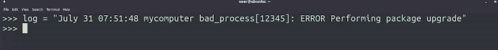</a>
			</p>
	* We want to extract the process identifier from this line, which is a number between the square brackets 12345
	* There's a lot of extra text in this log line that we don't need, like the date, the computer name and other info
	* We could extract the process ID by using the index method to find the first square bracket in the string
		* Remember that when accessing strings, the index of the character is the position of that character in the string starting from 0
	* In this example, the index of the first square bracket would be 39
		* If we don't want to capture the square brackets, we will start at the next version and include five more characters after that
			```python
			>>> log = "July 31 07:51:48 .... [12345] ..... upgrade" # complete text in image above
			>>> index = log.index('[')
			>>> print(log[index+1:index+6])
				12345
			```
		* Although we get the text that we wanted, we might hit a few bumps down the road
			* One problem is we don't know for sure how long the process ID string will be in all cases
			* In this example, we can see that it's five characters long. But that may change in the future if the computers restarted, or the number of processes increases
			* This could also break if for any reason, the line includes another square bracket before the process ID
			* So it's a solution but it's a very brittle one
	* We can also use regular expression to solve this problem and to extract the process ID in a more robust fashion
		* For that, we're going to import the __re module__, which lets us use the __search()__ function to find regular expressions inside strings
			```python
			>>> import re
			>>> log = "July 31 07:51:48 .... [12345] ..... upgrade" # complete text in image above
			>>> regex = r'\[(\d+)\]'
			>>> result = re.search(regex, log)
			>>> print(result[1])
				12345
			```
		* this regular expression will work no matter where our process ID shows up or how long or short the line is
		* As long as there's a single sequence of numbers in the string marked by square brackets, this regex will extract those numbers for us

### Basic Matching with grep

* We can also use regular expressions with a bunch of command line tools
* Grep is an especially easy to use yet extremely powerful tool for applying regexes
	* It's a great way to easily try out some expressions and get familiar with them
* __Remember__, that grep works by printing out any line that matches the query that we pass it
	* So for a simplest query of passing a plain old string, grep will print any lines containing that string in the file that we give it
* Example
	* Let's try this out using grep to find words inside the `/usr/share/dict/words` file, which is a file that some spell-checking programs use to verify if the word exists or not
	* This file contains one word per line
	* We'll start by looking at words that contain the particle __thon__
		```shell
		>>> grep thon /usr/share/dict/words
		```
		<p align="center">
		  <a href="javascript:void(0)" rel="noopener">
			 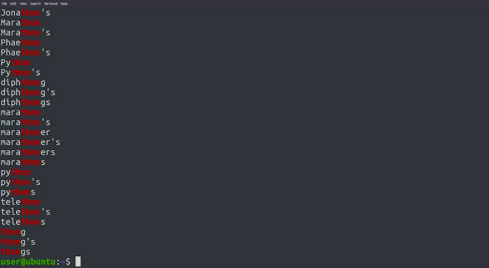</a>
		</p>
	* So when we call grep with thon as a pattern to match on and we pass our list of words as a file, we see that it matches with a bunch of different words
		* These words, all contain the string thon somewhere inside of them, which is why they appear in our results
	* We also see that the output is highlighted for us, showing us the matching part of the line in a different color
		* This added visual indicator is something that grep does for us so that we can easily see where the match occurred
	* It's worth calling out that the string we're passing in __grep__ is __case sensitive__
	* If we wanted to match a string regardless of case, we will have to pass the `-i` parameter to the __grep__ command
		```shell
		>>> grep -i python /usr/share/dict/words
		```
		<p align="center">
		  <a href="javascript:void(0)" rel="noopener">
			 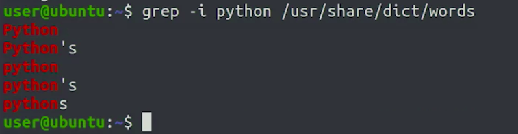</a>
		</p>
	* So we now know that any basic string is already a regular expression which will match a line that contains that string
* a __dot__ matches any character
	* This means that if we include a __dot__ in our expression, that __dot__ is a __wildcard__ that can be replaced by any other character in the results
		```shell
		>>> grep l.rts /usr/share/dict/words
		```
		<p align="center">
		  <a href="javascript:void(0)" rel="noopener">
			 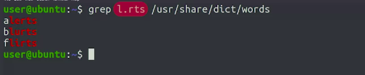</a>
		</p>
		* This pattern matches three different words; alerts, blurts, and flirts
		* Check out how for each of those words, the dot in our pattern was substituted by different letter
* We can find portions of texts that match a given pattern even when the pattern isn't a whole word
* For Example, We could use these
	1. to look for entries in a log file that match a certain format
	1. to find rows in a CSV file that share the same characteristics even if they are not exactly the same
* Some characters that we can use in Regular Expression are
	1. caret or circumflex or ^
		* The circumflex indicates the beginning
	1. dollar sign or $
		* The dollar sign indicates the end of the line
* For example
	1. to look for all the words that start with a string fruit, we would write grep circumflex fruit in our file
		```shell
		>>> grep ^fruit /usr/share/dict/words
		```
		<p align="center">
		  <a href="javascript:void(0)" rel="noopener">
			 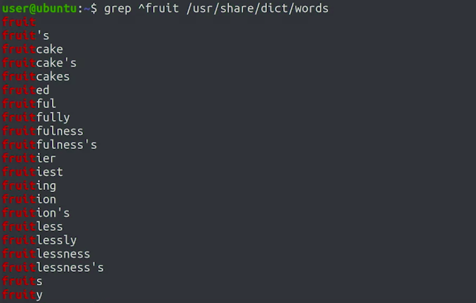</a>
		</p>
	1. to look for all the words that end with a string cat, we would write grep cat dollar sign in our file
		```shell
		>>> grep cat$ /usr/share/dict/words
		```
		<p align="center">
		  <a href="javascript:void(0)" rel="noopener">
			 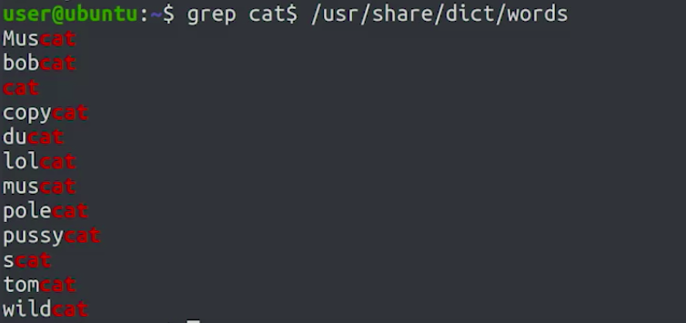</a>
		</p>
* __Remember__ is that the circumflex and the dollar sign specifically match the start and end of the line, not a string

## Basic Regular Expressions

### Simple Matching in Python

* We use the __re module__ to apply regular expressions in Python
	* This module includes a bunch of different functions that can help manipulate strings
* Example
	1. Search pattern in a String
		```python
		>>> import re
		>>> result = re.search(r'aza', 'plaza')
		>>> print(result)
			<re.Match object: span(2, 5), match='aza'> # Our result is a match object
		```
		* We call the search function on the re module, and told it to use the pattern 'aza' on the string 'plaza'
		* We then stored the return value of that function in the result variable
		* The __`r`__ at the beginning of the pattern indicates that this is a __rawstring__
			* This means that Python interpreter shouldn't try to interpret any special characters, and instead, should just pass the string to the function as is
		* Our __result__ variable contains a match object
		* The output we get when calling print already shows some interesting information, like the position in the string that matched ,and what the actual matching string was
			<p align="center">
			  <a href="javascript:void(0)" rel="noopener">
				 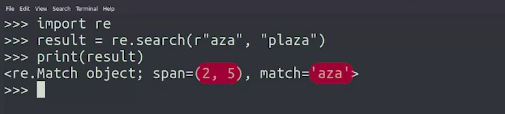</a>
			</p>
	1. Lets try same example with different strings
			<p align="center">
			  <a href="javascript:void(0)" rel="noopener">
				 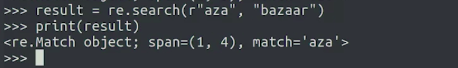</a>
			</p>
		* In this case, we can see that the span attribute is different
		* That's because the match sub-string is in a different position inside the string
		* In this case, we can see that the span attribute is different. That's because the match sub-string is in a different position inside the string
	1. If String does not match the pattern
		```python
		>>> import re
		>>> result = re.search(r'aza', 'maze')
		>>> print(result)
			None
		```
		* If the expression doesn't match the string that we pass, we get none as a result
		* __Remember__, __None__ is a special value that Python uses that show that there's none actual value there
		* When we're applying regular expressions, if the search function returns none, it means it didn't find a match
	1. Special Character in search pattern
		```python
		>>> import re
		>>> result = re.search(r'^x', 'xenon')
		>>> print(result)
			<re.Match object: span(0, 1), match='x'>
		```
		* We told the search function to use the __circumflex x__ or __`^x`__ pattern on the string 'xenon'
	1. If we use dot (.) in search string
		```python
		>>> import re
		>>> result = re.search(r'p.ng', 'penguin')
		>>> print(result)
			<re.Match object: span(0, 4), match='peng'>
		```
		* we're using p.ng as a search pattern.
		* It matches the word 'penguin' that we're passing
		* In the match object, we see the matching string is 'peng'
		* Some more strings to test on
				<p align="center">
				  <a href="javascript:void(0)" rel="noopener">
					 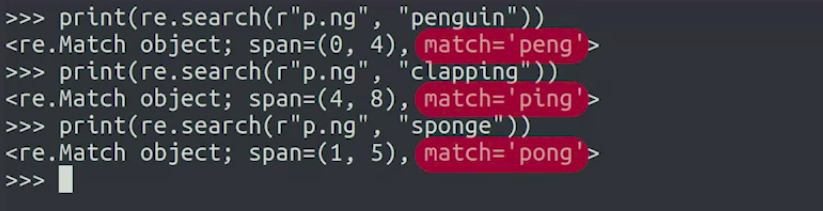</a>
				</p>
			* Here we can see the match attribute always has a value of the actual sub string that match the search pattern
			* The span attribute, indicates the range where the sub string can be found in the string we passed
* We can also pass additional options to the search function
	* For example
		1. If we want our match to be case insensitive, we can do this by passing the __re.IGNORECASE__ option
			```python
			>>> import re
			>>> result = re.search(r'p.ng', 'Pangaea', re.IGNORECASE)
			>>> print(result)
				<re.Match object: span(0, 4), match='Pang'>
			```
* __Always use rawstrings for regular expressions in Python__
* Sample Code
	* Fill in the code to check if the text passed contains the vowels a, e and i, with exactly one occurrence of any other character in between
		```python
		>>> import re
		>>> def check_aei (text):
		>>> 	# result = re.search(r"a.e.i", text)
		>>> 	# result = re.search(r"[aei].[aei].[aei]", text)
		>>> 	# result = re.search(r"[ae][^aei][ae]", text)
		>>> 	result = re.search(r"([aei]).\1", text)
		>>> 	return result != None
		>>> print(check_aei("academia")) # True
		>>> print(check_aei("aerial")) # False
		>>> print(check_aei("paramedic")) # True
		```

### Wildcards and Character Classes

* We can use a __dot__ in our regular expressions as a special character that can match any character
	* In the regex world, this is known as a __wildcard__ because it can match more than one character
* Using a __dot__ is the broadest possible wildcard because it matches absolutely any character
* __Character Classes__ are written inside square brackets and let us list the characters we want to match inside of those brackets
	* For example
		1. Lets say we want to match the word Python but allow for both lowercase or uppercase "p"
			```python
			>>> import re
			>>> result = re.search(r'[Pp]ython', 'Python')
			>>> print(result)
				<re.Match object: span(0, 6), match='Python'>
			```
		1. Inside the square brackets, we can also define a range of characters using a dash
			```python
			>>> import re
			>>> result = re.search(r'[a-z]way', 'The end of the highway')
			>>> print(result)
				<re.Match object: span(18, 22), match='hway'>
			>>> 
			>>> result = re.search(r'[a-z]way', 'What a way to go')
			>>> print(result)
				None
			```
			* We didn't get a match for second string
				* That's because the string way is preceded by a space and that doesn't match the range that we defined
	* We can define more ranges like
		1. upper case A to upper case Z for all upper case letters - `[A-Z]`
		1. 0 to 9 for all digits - `[0-9]`
	* We can combine as many ranges and symbols as we want
		```python
		>>> import re
		>>> result = re.search(r'cloud[a-zA-Z0-9]', 'cloudy')
		>>> print(result)
			<re.Match object: span(0, 6), match='cloudy'>
		>>> 
		>>> result = re.search(r'cloud[a-zA-Z0-9]', 'cloud9')
		>>> print(result)
			<re.Match object: span(0, 6), match='cloud9'>
		```
	* We may want to match any characters that aren't in a group
		* To do that, we use a circumflex inside the square brackets
		* Example
			* Example 1
				```python
				>>> import re
				>>> result = re.search(r'[^a-zA-Z]', 'This is a sentence with spaces.')
				>>> print(result)
					<re.Match object: span(4, 5), match=' '>
				```
				* our pattern matched the first space in the sentence
			* Example 2
				```python
				>>> import re
				>>> result = re.search(r'[^a-zA-Z ]', 'This is a sentence with spaces.')
				>>> print(result)
					<re.Match object: span(30, 31), match='.'>
				```
				* Because we added a space inside the character class, our example now matched the final dot in the sentence, which isn't in the list of characters to exclude
	* If we want to match either one expression or another, we can use the pipe symbol to do that
		* Example
			* We could have an expression that matches either the word cat or the word dog
				```python
				>>> import re
				>>> result = re.search(r'cat|dog', 'I like cats.')
				>>> print(result)
					<re.Match object: span(7, 10), match='cat'>
				>>> 
				>>> result = re.search(r'cat|dog', 'I like dogs.')
				>>> print(result)
					<re.Match object: span(7, 10), match='dog'>
				```
		* Example
			* Let's try a sentence with both dogs and cats
				```python
				>>> import re
				>>> result = re.search(r'cat|dog', 'I like both dogs and cats.')
				>>> print(result)
					<re.Match object: span(7, 10), match='dog'>
				```
			* In this string, we actually have two possible matches for our search. But we only get the first one
	* If we want to get all possible matches, we can do that using the __findall function__, which is also provided by the re module
		```python
		>>> import re
		>>> result = re.findall(r'cat|dog', 'I like both dogs and cats.')
		>>> print(result)
			['dog', 'cat']
		```
* Write Regex in the code to check if the text passed contains punctuation symbols: commas, periods, colons, semicolons, question marks, and exclamation points
	```python
	>>> import re
	>>> def check_punctuation (text):
	>>> 	result = re.search(r"[\,\.\:\;\?\!]", text)
	>>> 	return result != None
	>>> 
	>>> print(check_punctuation("This is a sentence that ends with a period.")) # True
	>>> print(check_punctuation("This is a sentence fragment without a period")) # False
	>>> print(check_punctuation("Aren't regular expressions awesome?")) # True
	>>> print(check_punctuation("Wow! We're really picking up some steam now!")) # True
	>>> print(check_punctuation("End of the line")) # False
	```

### Repetition Qualifiers

* __Repeated Matches__
	* It's quite common to see expressions that include a dot followed by a star
	* This means that it matches any character repeated as many times as possible including zero
	* Example
		1. First Example
			```python
			>>> import re
			>>> result = re.search(r"Py.*n", "Pygmalion")
			>>> print(result)
				<re.Match object: span(0, 9), match='Pygmalion'>
			```
			* In plain English, you could read this RegEx as match "Py", followed by any number of other characters followed by 'n'
			* But with our __dot star__ (`.*`) combination we expanded the range of the match to the whole word
		1. Second Example
			```python
			>>> import re
			>>> result = re.search(r"Py.*n", "Python Programming")
			>>> print(result)
				<re.Match object: span(0, 17), match='Python Programmin'>
			```
			* Remember, the Star takes as many characters as possible
				* In programming terms, we say that this behavior is __greedy__
				* It's possible to modify the repetition qualifiers to make them less greedy
			* While our pattern could have matched the word Python, it expanded all the way until the last 'n' in the string
		1. If we only wanted our patterns match letters, we should have used the character class instead
			```python
			>>> import re
			>>> result = re.search(r"Py[a-z]*n", "Python Programming")
			>>> print(result)
				<re.Match object: span(0, 6), match='Python'>
			>>>
			>>> result = re.search(r"Py.*n", "Pyn")
			>>> print(result)
				<re.Match object: span(0, 3), match='Pyn'>
			```
* Implementations of regular expressions aren't always the same
	* Repetition qualifiers are one way they differ
* Some implementations like the one used by __grep__ only include the __star__ (`*`) qualifier
* Other implementations like the one used by Python or by the Egrep command include two additional repetition qualifiers
	1. __plus__ (`+`)
		* The __plus character__ matches one or more occurrences of the character that comes before it
			* Example 1
				```python
				>>> import re
				>>> result = re.search(r"o+l+", "goldfish")
				>>> print(result)
					<re.Match object; span=(1, 3), match='ol'>
				```
				* In this case, there was one occurrence of each
				* In the match pattern shows us the shortest possible matching string
			* Example 2
				```python
				>>> import re
				>>> result = re.search(r"o+l+", "woolly")
				>>> print(result)
					<re.Match object; span=(1, 5), match='ooll'>
				```
				* There were two of each
				* We can see the match is a whole string that matches the condition
			* Example 3
				```python
				>>> import re
				>>> result = re.search(r"o+l+", "boil")
				>>> print(result)
					None
				```
				* So while our string here had an O and an L, it had another character in between them. Because of this, it doesn't match the search pattern
	1. __question mark__ (`?`)
		* The question mark symbol is yet another multiplier
		* It means either zero or one occurrence of the character before it
		* Example 1
			```python
			>>> import re
			>>> result = re.search(r"p?each", "To each their own")
			>>> print(result)
				<re.Match object; span=(3, 7), match='each'>
			```
			* The "P" wasn't present but with the question mark we marked it as optional, so we still got a match
		* Example 2
			```python
			>>> import re
			>>> result = re.search(r"p?each", "I like peaches")
			>>> print(result)
				<re.Match object; span=(7, 12), match='peach'>
			```
			* The "P" was president and so match included it
* The repeating_letter_a function checks if the text passed includes the letter "a" (lowercase or uppercase) at least twice. For example, repeating_letter_a("banana") is True, while repeating_letter_a("pineapple") is False
	```python
	>>> import re
	>>> def repeating_letter_a(text):
	>>> 	result = re.search(r"([aA].*){2}", text)
	>>> 	return result != None
	>>> 
	>>> print(repeating_letter_a("banana")) # True
	>>> print(repeating_letter_a("pineapple")) # False
	>>> print(repeating_letter_a("Animal Kingdom")) # True
	>>> print(repeating_letter_a("A is for apple")) # True
	```

### Escaping Characters

* Special Characters that we can use in our regular expressions to make them match different kinds of strings
	1. __dot__ `.`
	1. __star__ `*`
	1. __plus__ `+`
	1. __question mark__ `?`
	1. __circumflex__ `^`
	1. __dollar sign__ `$`
	1. __square brackets__ `[]`
* Lets say we wanted to check that a certain string contained a __dot__ as part of it
	* If we just put a dot in regex, it would match any character
	* Example
		1. We want to match a strings that had __.com__ in them
			```python
			>>> import re
			>>> result = re.search(r".com", "welcome")
			>>> print(result)
				<re.Match object; span=(2, 6), match='lcom'>
			```
			* To match an actual dot, we need to use an Escape character, which in the case of regular expressions is a backslash character
				```python
				>>> import re
				>>> result = re.search(r"\.com", "welcome")
				>>> print(result)
					None
				```
				* By escaping the dot, it no longer matched the word Welcome, and since there's no __.com__ in the string, it returned None
		1. Example 2
			```python
			>>> import re
			>>> result = re.search(r"\.com", "mydomain.com")
			>>> print(result)
				<re.Match object; span=(8, 12), match='.com'>
			```
			* By adding the __backslash__, we've got this to correctly match what we wanted it to match
			* We can use a __backslash__ in this way to escape any special characters
* When we see a __pattern__ that includes a __backslash__, it could be escaping a __special regex character__ or a __special string character__
* Using raw strings, like we've been doing, helps avoid some of these possible confusion because the special characters won't be interpreted when generating the string
	* They will only be interpreted when parsing the regular expression
* Python also uses the backslash for a few special sequences that we can use to represent predefined sets of characters
	1. `\w` - matches any alphanumeric character including letters, numbers, and underscores
		```python
		>>> import re
		>>> result = re.search(r"\w*", "This is an example") # 1st Example
		>>> print(result)
			<re.Match object; span=(0, 4), match='This'>
		>>>
		>>> result = re.search(r"\w*", "And_this_is_another") # 2nd Example
		>>> print(result)
			<re.Match object; span=(0, 19), match='And_this_is_another'>
		```
		* In 1st Example, Our pattern matched the first four letters until the space because spaces aren't part of that set of characters
		* In 2nd Example, it matched the whole string
	1. `\d` - for matching digits
	1. `\s` - for matching whitespace characters like space, tab or new line
	1. `\b` - for word boundaries
* Write Regex to check if the text passed has at least 2 groups of alphanumeric characters (including letters, numbers, and underscores) separated by one or more whitespace characters
	```python
	>>> import re
	>>> def check_character_groups(text):
	>>> 	# result = re.search(r"\w \w*", text)
	>>> 	result = re.search(r"[\w*][\s*][\w*]", text)
	>>> 	return result != None
	>>> 
	>>> print(check_character_groups("One")) # False
	>>> print(check_character_groups("123  Ready Set GO")) # True
	>>> print(check_character_groups("username user_01")) # True
	>>> print(check_character_groups("shopping_list: milk, bread, eggs.")) # False
	```
* __Great resource for testing__ out your regular expressions is a website called __[Regex 101 Website](https://regex101.com/)__

### Regular Expressions in Action

* We can combine these special characters to create patterns to match the text that we want
* For example
	1. Say you had a list of all the countries in the world and you want to check which of those names start and end in 'a'
		* Checking for Country : Argentina
			```python
			>>> import re
			>>> result = re.search(r"A.*a", "Argentina")
			>>> print(result)
				<re.Match object; span=(0, 9), match='Argentina'>
			```
			* Pattern works for this Country : Azerbaijan
		* Checking for country
			```python
			>>> import re
			>>> result = re.search(r"A.*a", "Azerbaijan")
			>>> print(result)
				<re.Match object; span=(0, 9), match='Azerbaija'>
			```
			* Pattern did not work as expected
			* this happened because we didn't specify that we wanted our patterns match the whole string
			* So while Azerbaijan doesn't finish with A, it does have an A in its name. So it matches our pattern
			* We need to make our patterns stricter by adding the beginning of a line and end of a line characters
				```python
				>>> import re
				>>> result = re.search(r"^A.*a$", "Azerbaijan")
				>>> print(result)
					None
				```
				* By adding a dollar sign to our pattern, we've made it clear that we only want to match lines that begin and end with the letter 'a'
					* So Azerbaijan doesn't match anymore
		* Checking for Country : Australia
			```python
			>>> import re
			>>> result = re.search(r"^A.*a$", "Australia")
			>>> print(result)
				<re.Match object; span=(0, 9), match='Australia'>
			```
			* This Pattern works fine for Australia
* Using __regular expressions__, we can also construct a pattern that would validate if the string is a valid variable name in Python
	* __Rule__ : It can contain any number of letters numbers or underscores, but it can't start with a number
	* __Validating pattern__ : `pattern = r"^[a-zA-Z_][a-zA-Z0-9_]*$"`
		1. We said it needs to start with a letter
			* So we'll start with circumflex to indicate that we wanted to start from the beginning
		1. Now a character class with all lowercase and uppercase letters plus the underscore
		1. The rest of the variable can have as many numbers letters or underscores that we want
			* So we needed another character class this time containing numbers with a star at the end
		1. We want this to be the end of the string that we're matching. Otherwise, we could match something that could be a variable, but that also contains additional stuff after it
			* We finish up with a dollar sign
	* __Pattern Testing__
		* Test 1 : String has Underscores
			```python
			>>> import re
			>>> pattern = r"^[a-zA-Z_][a-zA-Z0-9_]*$"
			>>> result = re.search(pattern, "this_is_a_valid_variable_name")
			>>> print(result)
				<re.Match object; span=(0, 29), match='this_is_a_valid_variable_name'>
			```
			* we can use underscores anywhere in the string
			* It matches our validation pattern because we included underscores in it
		* Test 2 : String has spaces
			```python
			>>> import re
			>>> pattern = r"^[a-zA-Z_][a-zA-Z0-9_]*$"
			>>> result = re.search(pattern, "this isn't a valid variable name")
			>>> print(result)
				None
			```
			* Once we use a space, it stops being a valid variable name
			* It doesn't matter pattern because spaces aren't included in the possible characters
		* Test 3 : String includes number
			```python
			>>> import re
			>>> pattern = r"^[a-zA-Z_][a-zA-Z0-9_]*$"
			>>> result = re.search(pattern, "my_variable1")
			>>> print(result)
				<re.Match object; span=(0, 12), match='my_variable1'>
			```
			* We can use numbers inside the variable name
			* Our pattern includes all numbers as part of the variable
		* Test 4 : String starts with a number
			```python
			>>> import re
			>>> pattern = r"^[a-zA-Z_][a-zA-Z0-9_]*$"
			>>> result = re.search(pattern, "2my_variable1")
			>>> print(result)
				None
			```
			* The variable the number at the beginning isn't a valid variable name
			* In our pattern doesn't match it because the first of two character classes doesn't include numbers
* Write a Regex to check if the text passed looks like a standard sentence, meaning that it starts with an uppercase letter, followed by at least some lowercase letters or a space, and ends with a period, question mark, or exclamation point
	```python
	>> import re
	>> def check_sentence(text):
	>> 	result = re.search(r"^[A-Z][a-z ]*[\.\?\!]$", text)
	>> 	return result != None
	>> 
	>> print(check_sentence("Is this is a sentence?")) # True
	>> print(check_sentence("is this is a sentence?")) # False
	>> print(check_sentence("Hello")) # False
	>> print(check_sentence("1-2-3-GO!")) # False
	>> print(check_sentence("A star is born.")) # True
	```
* The check_web_address function checks if the text passed qualifies as a top-level web address, meaning that it contains alphanumeric characters (which includes letters, numbers, and underscores), as well as periods, dashes, and a plus sign, followed by a period and a character-only top-level domain such as ".com", ".info", ".edu", etc. Fill in the regular expression to do that, using escape characters, wildcards, repetition qualifiers, beginning and end-of-line characters, and character classes
	```python
	>>> import re
	>>> def check_web_address(text):
	>>> 	pattern = r'^[\w\-\.\+]+(\.)[a-zA-Z]+$'
	>>> 	result = re.search(pattern, text)
	>>> 	return result != None
	>>> 
	>>> print(check_web_address("gmail.com")) # True
	>>> print(check_web_address("www@google")) # False
	>>> print(check_web_address("www.Coursera.org")) # True
	>>> print(check_web_address("web-address.com/homepage")) # False
	>>> print(check_web_address("My_Favorite-Blog.US")) # True
	```
* The check_time function checks for the time format of a 12-hour clock, as follows: the hour is between 1 and 12, with no leading zero, followed by a colon, then minutes between 00 and 59, then an optional space, and then AM or PM, in upper or lower case.
	```python
	>>> import re
	>>> def check_time(text):
	>>> 	# pattern = r"^([1-9]|10|11|12)[:][0-5][0-9]\s*[aApP][Mm]"
	>>> 	pattern = r'^[1-9][0-2]?:[0-5][0-9] ?[AM|PM|am|pm]'
	>>> 	result = re.search(pattern, text)
	>>> 	return result != None
	>>> 
	>>> print(check_time("12:45pm")) # True
	>>> print(check_time("9:59 AM")) # True
	>>> print(check_time("6:60am")) # False
	>>> print(check_time("five o'clock")) # False
	```
* The contains_acronym function checks the text for the presence of 2 or more characters or digits surrounded by parentheses, with at least the first character in uppercase (if it's a letter), returning True if the condition is met, or False otherwise. For example, "Instant messaging (IM) is a set of communication technologies used for text-based communication" should return True since (IM) satisfies the match conditions."
	```python
	>>> import re
	>>> def contains_acronym(text):
	>>> 	# pattern = r"^[a-z|A0-9-Z ]"
	>>> 	pattern = r"\([A-Z0-9][A-Za-z]*\)"
	>>> 	result = re.search(pattern, text)
	>>> 	return result != None
	>>> 
	>>> print(contains_acronym("Instant messaging (IM) is a set of communication technologies used for text-based communication")) # True
	>>> print(contains_acronym("American Standard Code for Information Interchange (ASCII) is a character encoding standard for electronic communication")) # True
	>>> print(contains_acronym("Please do NOT enter without permission!")) # False
	>>> print(contains_acronym("PostScript is a fourth-generation programming language (4GL)")) # True
	>>> print(contains_acronym("Have fun using a self-contained underwater breathing apparatus (Scuba)!")) # True
	```
* Write a Regex to check if the text passed includes a possible U.S. zip code, formatted as follows: exactly 5 digits, and sometimes, but not always, followed by a dash with 4 more digits. The zip code needs to be preceded by at least one space, and cannot be at the start of the text
	```python
	>>> import re
	>>> def check_zip_code (text):
	>>> 	# result = re.search(r"[ ]\d{5}|[ ]\d{5}-\d{4}", text)
	>>> 	# result = re.search(r"[^a-zA-Z][0-9]{5}|[0-9]{4}[-]", text)
	>>> 	# result = re.search(r"\s\d{5}[ \.]|[-]\d{4}[^0-9]", text)
	>>> 	result = re.search(r"\s\d{5}|[-]\d{4}[^0-9]", text)
	>>> 	return result != None
	>>> 
	>>> print(check_zip_code("The zip codes for New York are 10001 thru 11104.")) # True
	>>> print(check_zip_code("90210 is a TV show")) # False
	>>> print(check_zip_code("Their address is: 123 Main Street, Anytown, AZ 85258-0001.")) # True
	>>> print(check_zip_code("The Parliament of Canada is at 111 Wellington St, Ottawa, ON K1A0A9.")) # False
	```

> __Raw Strings__ just means the Python interpreter won't try to interpret any special characters and, instead, will just pass the string to the function as it is.

## Advanced Regular Expressions

### Capturing Groups

* __Capturing Groups__ are portions of the pattern that are enclosed in parentheses
	* For Example
		* Let's say that we have a list of people's full names. These names are stored as last name, comma, first name
			* We want to turn this around and create a string that starts with the first name followed by the last name
			* We can do this using a regular expression with capturing groups
			* To do this
				* First we'll create a matching pattern that matches a group of letters followed by a comma, a space, and then another group of letters
				* To capture our groups, we'll put each group of letters between parentheses like this
					```python
					>>> import re
					>>> result = re.search(r"^(\w*), (\w*)$", "Lovelace, Ada")
					>>> print(result)
						<re.Match object; span=(0, 13), match='Lovelace, Ada'>
					```
					* __Remember__ that \w will match letters, numbers, and underscores
					* The match object has more attributes and methods than the ones shown by print
	* __groups()__ method
		* Because we defined two separate groups, the __group()__ method returns a tuple of two elements
			```python
			>>> import re
			>>> result = re.search(r"^(\w*), (\w*)$", "Lovelace, Ada")
			>>> print(result)
				<re.Match object; span=(0, 13), match='Lovelace, Ada'>
			>>>
			>>> print(result.groups())
				('Lovelace', 'Ada')
			```
		* We can also use indexing to access these groups
		* The first element contains the text matched by the entire regular expression
		* Each successive element contains the data that was matched by every subsequent match group
			```python
			>>> import re
			>>> result = re.search(r"^(\w*), (\w*)$", "Lovelace, Ada")
			>>> print(result)
				<re.Match object; span=(0, 13), match='Lovelace, Ada'>
			>>>
			>>> print(result.groups())
				('Lovelace', 'Ada')
			>>>
			>>> print(result[0])
				Lovelace, Ada
			>>> ## Now, the following index is correspond to each of the captured groups
			>>> print(result[1])
				Lovelace
			>>> print(result[2])
				Ada
			>>>
			>>> ## We can construct the name that we want by using these indexes
			>>> '{} {}'.format(result[2], result[1])
				Ada Lovelace
			```
		* Creating function for above regex pattern
			```python
			>>> import re
			>>> def rearrange_name(name):
			>>> 	pattern = r"^(\w*), (\w*)$"
			>>> 	result = re.search(pattern, name)
			>>> 	if result is None:
			>>> 		return name
			>>> 	return '{} {}'.format(result[2], result[1])
			```
			<p align="center">
			  <a href="javascript:void(0)" rel="noopener">
				 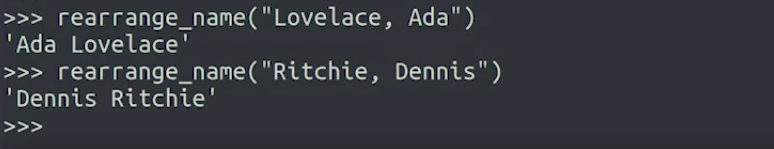</a>
			</p>
		* The regular expression used in the rearrange_name function so that it can match middle names, middle initials, as well as double surnames
			```python
			>>> import re
			>>> def rearrange_name(name):
			>>> 	# result = re.search(r"^(\w*), ([\w \.\-]*)$", name)
			>>>		result = re.search(r"^([\w \.-]*), ([\w \.-]*)$", name)
			>>> 	if result == None:
			>>> 		return name
			>>> 	return "{} {}".format(result[2], result[1])
			>>> 
			>>> name=rearrange_name("Kennedy, John F.")
			>>> print(name)
				John F. Kennedy
			```

### More on Repetition Qualifiers

* Python offers __Numeric Repetition Qualifiers__
	* These are written between curly brackets and can be one or two numbers specifying a range
	* For example
		* To match any string of exactly five letters
			 ```python
			>>> import re
			>>> result = re.search(r"[a-zA-Z]{5}", "a ghost")
			>>> print(result)
				<re.Match object; span=(2, 7), match='ghost'>
			>>>
			```
			* __Remember__, that the expression will match whichever part of the given string that fits the criteria
			* In this case, we're looking for letters that are repeated five times, and ghost has five letters, so it matched our pattern
		* String with multiple matches, we get only the first one
			```python
			>>> import re
			>>> result = re.search(r"[a-zA-Z]{5}", "a scary ghost appeared")
			>>> print(result)
				<re.Match object; span=(2, 7), match='scary'>
			>>>
			```
			* In this string, we actually have more matches for our search, but we only get the first one
		* Using __findall__ function, to get all the matches
			```python
			>>> import re
			>>> result = re.findall(r"[a-zA-Z]{5}", "a scary ghost appeared")
			>>> print(result)
				['scary', 'ghost', 'appea']
			>>>
			```
			* Now we have an extra match for the word that's actually longer
		* Using \b, which matches word limits at the beginning and end of the pattern, to indicate that we want full words
			* We want to match all the words that are exactly five letters long
				```python
				>>> import re
				>>> result = re.findall(r"\b[a-zA-Z]{5}\b", "A scary ghost appeared")
				>>> print(result)
					['scary', 'ghost']
				>>>
				```
		* We can also have 2 numbers in the range
			* For example
				* If we wanted to match a range of five to ten letters or numbers
					```python
					>>> import re
					>>> result = re.findall(r"\w{5,10}", "I really like strawberries")
					>>> print(result)
						['really', 'strawberri']
					>>>
					```
					* These ranges can also be open ended
					* A number followed by a comma means at least that many repetitions with no upper boundary limited only by the maximum repetitions in the source text
						```python
						>>> import re
						>>> result = re.findall(r"\w{5,}", "I really like strawberries")
						>>> print(result)
							['really', 'strawberries']
						>>>
						```
				* A comma followed by a number means from zero up to that amount of repetitions
					```python
					>>> import re
					>>> result = re.search(r"s\w{,20}", "I really like strawberries")
					>>> print(result)
						<re.Match object; span=(14, 26), match='strawberries'>
					>>>
					```
					* We look for a pattern that was an S followed by up to 20 alphanumeric characters.
						* So we got a match for strawberries which starts with S, and is followed by 11 characters
							<p align="center">
							  <a href="javascript:void(0)" rel="noopener">
								 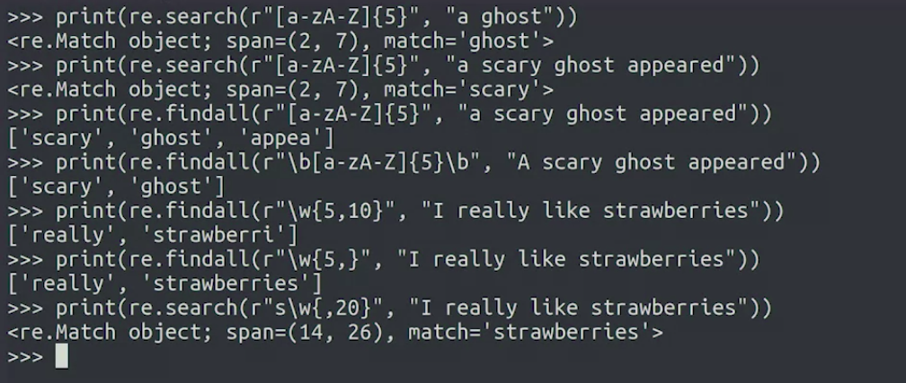</a>
							</p>
* Write Regex for The long_words function returns all words that are at least 7 characters
	```python
	>>> import re
	>>> def long_words(text):
	>>> 	pattern = r'\w{7,}'
	>>> 	result = re.findall(pattern, text)
	>>> 	return result
	>>> 
	>>> print(long_words("I like to drink coffee in the morning.")) # ['morning']
	>>> print(long_words("I also have a taste for hot chocolate in the afternoon.")) # ['chocolate', 'afternoon']
	>>> print(long_words("I never drink tea late at night.")) # []
	```

### Extracting a PID Using regexes in Python

* Extracting PID 
	* Pattern : `regex = r"\[(\d+)]"`
	* Log : log = "July 31 07:51:48 mycomputer bad_process[12345]: ERROR Performing package upgrade"
		```python
		>>> import re
		>>> log = "July 31 07:51:48 mycomputer bad_process[12345]: ERROR Performing package upgrade"
		>>> regex = r"\[(\d+)]"
		>>> result = re.search(regex, log)
		>>> print(result[1])
			12345
		```
		* The first character of the pattern is the __backslash__, which is used as the __escape character__
			* This means that the next character, which is a __square bracket__, is treated literally for __matching purposes__
		* After the square bracket, comes the first parentheses
			* Since it isn't escaped, we know it'll be used as a __capturing group__
		* The __capturing group__ parentheses are wrapping the backslash `d+` symbols
			* we know that this expression will match __one or more numerical characters__
		* After the closing parentheses of the capturing group, we have the closing square bracket symbol, also proceeded by the escape character
		* After calling the __search()__ function, we know that because we're capturing __groups__ in an expression, we can access the __matching data__ by accessing the value __at index 1__
	* Example
		```python
		>>> import re
		>>> text_string = "A completely different string that also has numbers [34567]"
		>>> regex = r"\[(\d+)]"
		>>> result = re.search(regex, text_string)
		>>> print(result[1])
			34567
		```
	* If our string didn't actually have a block of numbers between the square brackets
		```python
		>>> import re
		>>> text_string = "99 elephants in a [cage]"
		>>> regex = r"\[(\d+)]"
		>>> result = re.search(regex, text_string)
		>>> print(result[1])
			ERROR: IMAGE BELOW
		```
		<p align="center">
		  <a href="javascript:void(0)" rel="noopener">
			 </a>
		</p>
		* We tried to access the index 1 of a variable that was None
		* As Python tells us, this isn't something that we can do
	* We should have a function that extracts the process ID or PID when possible, and does something else if not
		```python
		>>> def extract_pid(log_line):
		>>> 	regex = r"\[(\d+)]"
		>>> 	result = re.search(regex, log_line)
		>>> 	if result is None:
		>>> 		return ""
		>>> 	return result[1]
		>>> print(extract_pid(log))
			12345
		>>> print(extract_pid("99 elephants in a [cage]"))
			'' # Did not match, so empty string is returned
		```
* the regular expression used in the extract_pid function, to return the uppercase message in parenthesis, after the process id.
	```python
	>>> import re
	>>> def extract_pid(log_line):
	>>>     # regex = r"\[(\d+)\]\: (\b[A-Z]+\b)"
	>>>     # regex = r"\[(\d+)\]\:\s(\b[A-Z]{2,}\b)"
	>>>     regex = r"\[(\d+)\]\:\s(\b[A-Z]+\b)"
	>>>     result = re.search(regex, log_line)
	>>>     if result is None:
	>>> 		return None
	>>> 	# print(result.groups())
	>>> 	return "{} ({})".format(result[1], result[2])
	>>> 
	>>> print(extract_pid("July 31 07:51:48 mycomputer bad_process[12345]: ERROR Performing package upgrade")) # 12345 (ERROR)
	>>> print(extract_pid("99 elephants in a [cage]")) # None
	>>> print(extract_pid("A string that also has numbers [34567] but no uppercase message")) # None
	>>> print(extract_pid("July 31 08:08:08 mycomputer new_process[67890]: RUNNING Performing backup")) # 67890 (RUNNING)
	```

### Splitting and Replacing

* There are actually a few more functions in __re module__ that can be really handy depending on what we're trying to do
	1. __split()__ function
		* It works similarly to the split function that we used before with strings
			* But instead of taking a string as a separator, you can take any regular expression as a separator
		* Example
			* We may want to split a piece of text into separate sentences
				* To do that we need to check not only for the dots but also for question marks or exclamation marks since they're also valid sentence endings
					```python
					>>> import re
					>>> result = re.split(r"[.?!]", "One sentence. Another one? And the last one!")
					>>> print(result)
						['One sentence', ' Another one', ' And the last one', '']
					```
					* Check out how we are not escaping the characters that we wrote inside the square brackets
						* That's because anything that's inside the square brackets is taking for the literal character and not for its special meaning
					* Also see how the notation marks aren't present in the resulting list
			* If we want our split list to include the elements that we're using to split the values we can use capturing parentheses
				```python
				>>> import re
				>>> result = re.split(r"([.?!])", "One sentence. Another one? And the last one!")
				>>> print(result)
					['One sentence', '.', ' Another one', '?', ' And the last one', '!', '']
				```
				* This gave us both the sentences and notation marks as elements of a list
	1. __sub()__ function
		* It's used for creating new strings by substituting all or part of them for a different string
		* similar to the replace string method but using regular expressions for both the matching and the replacing
		* For Example
			1. Let's see this in an example. So we had some logs in our system that included e-mail addresses of users and we wanted to anonymize the data by removing all the addresses
				```python
				>>> import re
				>>> result = re.sub(r"[\w.%+-]+@[\w.-]+", "[REDACTED]", "Received an email for go_nuts95@my.example.com")
				>>> print(result)
					Received an email for [REDACTED]
				```
				* The expression that we're using for identifying email addresses has two parts: the part before that __at (@)__ sign and the part after it
				* Part before __at (@)__ sign
					* We include the alphanumeric characters represented by backslash w which includes letters, numbers, and the underscore sign as well as a dot, percentage sign, plus, and dash
				* After the at sign
					* we only allow the alphanumeric characters dot and dash
				* This will match all email addresses as well as some strings that aren't really valid email addresses like an address with two dots
			1. Switch the order of names of people and use sub to create the new string
				```python
				>>> import re
				>>> result = re.sub(r"^([\w \.-]*), ([\w \.-]*)$", r'\2 \1', "Lovelace, Ada")
				>>> print(result)
					Ada Lovelace
				```
				* In the first parameter, we've got an expression that contains the two groups that we want to match: one before the comma and one after the comma
				* We want to use a second parameter to replace the matching string
				* We use __backslash two__ to indicate the second captured group followed by a space and __backslash one__ to indicate the first captured group
				* __When referring to captured groups, a backslash followed by a number indicates the corresponding captured group__
					* This is a general notation for regular expressions, and it's used by many tools that support regexes, not just Python
					* We can also use them to match patterns that repeat themselves which use capturing groups as back references
* We're working with a CSV file, which contains employee information. Each record has a name field, followed by a phone number field, and a role field. The phone number field contains U.S. phone numbers, and needs to be modified to the international format, with "+1-" in front of the phone number. Fill in the regular expression, using groups, to use the transform_record function to do that
	```python
	>>> import re
	>>> def transform_record(record):
	>>> 	new_record = re.sub(r"\b(\d{3}-\d{3}-?\d{4})\b",r"+1-\1",record)
	>>> 	return new_record
	>>> 
	>>> print(transform_record("Sabrina Green,802-867-5309,System Administrator")) 
	>>> # Sabrina Green,+1-802-867-5309,System Administrator
	>>> 
	>>> print(transform_record("Eli Jones,684-3481127,IT specialist")) 
	>>> # Eli Jones,+1-684-3481127,IT specialist
	>>> 
	>>> print(transform_record("Melody Daniels,846-687-7436,Programmer")) 
	>>> # Melody Daniels,+1-846-687-7436,Programmer
	>>> 
	>>> print(transform_record("Charlie Rivera,698-746-3357,Web Developer")) 
	>>> # Charlie Rivera,+1-698-746-3357,Web Developer
	```
* The multi_vowel_words function returns all words with 3 or more consecutive vowels (a, e, i, o, u). Fill in the regular expression to do that
	```python
	>>> import re
	>>> def multi_vowel_words(text):
	>>> 	pattern = r'\b\w*[aeiou]{3,}\w*\b'
	>>> 	result = re.findall(pattern, text)
	>>> 	return result
	>>> 
	>>> print(multi_vowel_words("Life is beautiful")) 
	>>> # ['beautiful']
	>>> 
	>>> print(multi_vowel_words("Obviously, the queen is courageous and gracious.")) 
	>>> # ['Obviously', 'queen', 'courageous', 'gracious']
	>>> 
	>>> print(multi_vowel_words("The rambunctious children had to sit quietly and await their delicious dinner.")) 
	>>> # ['rambunctious', 'quietly', 'delicious']
	>>> 
	>>> print(multi_vowel_words("The order of a data queue is First In First Out (FIFO)")) 
	>>> # ['queue']
	>>> 
	>>> print(multi_vowel_words("Hello world!")) 
	>>> # []
	```
* The transform_comments function converts comments in a Python script into those usable by a C compiler. This means looking for text that begins with a hash mark (#) and replacing it with double slashes (//), which is the C single-line comment indicator. For the purpose of this exercise, we'll ignore the possibility of a hash mark embedded inside of a Python command, and assume that it's only used to indicate a comment. We also want to treat repetitive hash marks (##), (###), etc., as a single comment indicator, to be replaced with just (//) and not (#//) or (//#). Fill in the parameters of the substitution method to complete this function
	```python
	>>> import re
	>>> def transform_comments(line_of_code):
	>>> 	result = re.sub('#{1,}', '//', line_of_code)
	>>> 	return result
	>>> 
	>>> print(transform_comments("### Start of program")) 
	>>> # Should be "// Start of program"
	>>> print(transform_comments("  number = 0   ## Initialize the variable")) 
	>>> # Should be "  number = 0   // Initialize the variable"
	>>> print(transform_comments("  number += 1   # Increment the variable")) 
	>>> # Should be "  number += 1   // Increment the variable"
	>>> print(transform_comments("  return(number)")) 
	>>> # Should be "  return(number)"
	```
* The convert_phone_number function checks for a U.S. phone number format: XXX-XXX-XXXX (3 digits followed by a dash, 3 more digits followed by a dash, and 4 digits), and converts it to a more formal format that looks like this: (XXX) XXX-XXXX. Fill in the regular expression to complete this function
	```python
	>>> import re
	>>> def convert_phone_number(phone):
	>>> 	result = re.sub(r'(\d{3})-(\d{3})-(\d{4})\b', r'(\1) \2-\3', phone)
	>>> 	return result
	>>> 
	>>> print(convert_phone_number("My number is 212-345-9999.")) # My number is (212) 345-9999.
	>>> print(convert_phone_number("Please call 888-555-1234")) # Please call (888) 555-1234
	>>> print(convert_phone_number("123-123-12345")) # 123-123-12345
	>>> print(convert_phone_number("Phone number of Buckingham Palace is +44 303 123 7300")) # Phone number of Buckingham Palace is +44 303 123 7300
	```
