Using Python to Interact with the Operating System
==================================================

by Google

# Module 4
#
## Title: Managing Data and Processes

## Data Streams

### Reading Data Interactively

* Using files to store information and then processing that data over a script is a great way to build automation
	* But sometimes we need to interact with the user and ask them for certain pieces of information that just can't be stored in a file
	* To do this Python provides a function called __input__
		```python
		>>> name = input("Please enter your name: ")
		>>> print('Hello, ', name)
		```
		<p align="center">
		  <a href="javascript:void(0)" rel="noopener">
			 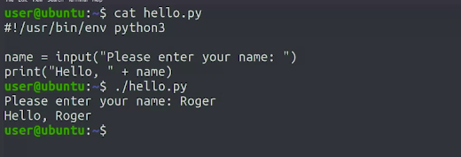</a>
		</p>
* __input()__ function - This function allows us to prompt the user for a certain value that we can then use for our scripts
	* the __input()__ function always returns a string
	* If we want the data that we're reading to be a different data type like a number or a date, then we need to convert the string to a format that we want
			<p align="center">
			  <a href="javascript:void(0)" rel="noopener">
				 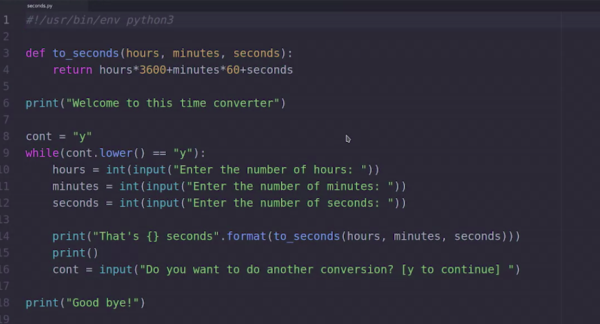</a>
			</p>
		* First, we define a function that converts into seconds the number of hours, minutes, and seconds
		* The actual program starts by printing a welcome message and then entering a while loop
		* See how we first initialized the cont variable that we'll use to check whether the user wants to continue or not?
		* In the body of the while loop, we ask the user to provide the number of hours, minutes, and seconds for the conversion
			* As our two seconds function requires integers, we're converting the value returned by the input function using the __int__ function
		* With those three values, we then call the function and print the result
		* After that we ask the user whether they want to do another conversion or not
			<p align="center">
			  <a href="javascript:void(0)" rel="noopener">
				 </a>
			</p>

> **to_seconds(hours, minutes, seconds)** : This line of code uses a function to convert the number of hours, minutes, and seconds into seconds (Line taken from Code shown as an example above second.py)

### Standard Streams

* Python program used __I/O stream__ connect to both the screen and the keyboard
* __I/O streams__ are the basic mechanism for performing input and output operations in your programs
	* You can think of these streams as pathways between your programs and their input sources like a keyboard, or output, like the screen
* When we run a system command on our __terminal__, __I/O streams__ are also being used to connect that __command__ to the __terminal__ input and output
	* This way, we can see the results of the command or enter data interactively if that's how the program works
* We call these __streams__ because the __data keeps flowing__
* A program can read input and generate output as long as it needs to achieve its goal
* Most operating systems supply three different I/O streams by default each with a different purpose
	1. The __Standard Input Stream__ commonly referred to as __STDIN__ is a channel between a program and a source of input
		* Usually in the form of text data from the keyboard
		* When we use the input function to accept user input in a Python script we're using the STDIN stream
	1. The __Standard Output Stream__ or __STDOUT__ is a pathway between a program and a target of output, like a display
		* __STDOUT__ generally takes the form of text displayed in a terminal
		* As that play when we use the print function to write information to the screen
	1. The __Standard Error__, or __STDERR__
		* __Standard Error__ displays output like standard out, but is used specifically as a channel to show error messages and diagnostics from the program
		* It's usually printed to the screen
		* If you've ever run some Python code and receive an error, then that error message was probably printed using standard error stream
			<p align="center">
			  <a href="javascript:void(0)" rel="noopener">
				 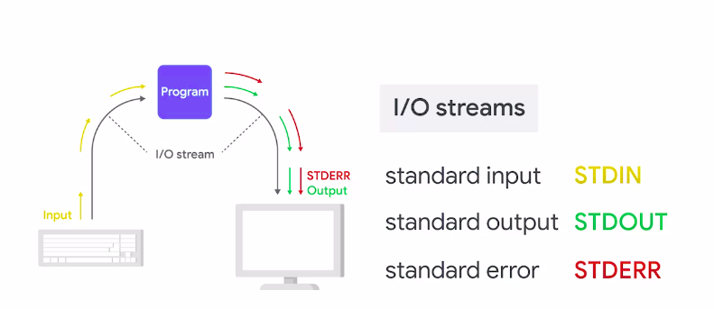</a>
			</p>
* Example for I/O Stream
	```python
	>>> #! /usr/bin/env python3
	>>>
	>>> data = input('This will come from STDIN: ') 
	>>> print('Now we write it to STDOUT: ' + data)
	>>> print('Now we generate an error to STDERR: ' + data + 1)
	```
	* Our script here has three lines, each line is interacting with different stream.
	* In the first one, we read from standard input
	* In the second one, we write to standard output
	* In the last one, we generate an error by concatenating a string to an integer
		* This error will be printed to standard error, let's try it out
			<p align="center">
			  <a href="javascript:void(0)" rel="noopener">
				 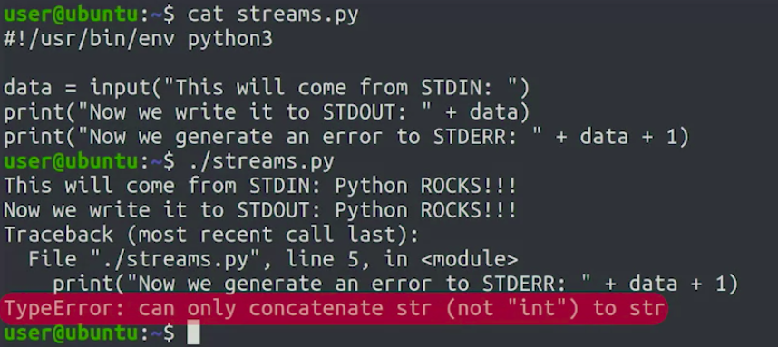</a>
			</p>

> __I/O streams__ are ways for programs to get and receive information

### Environment Variables

* When we open a terminal application on a Linux computer, whether it's local or a remote machine, the application that reads and executes all commands is called a __shell__
	* A __shell__ is a command line interface used to interact with your __operating system__
	* The most __commonly__ used __shell__ on Linux is called __Bash__
	* Other popular shells are __Zsh__ and __Fish__, while they operate in similar ways
	* Python programs get executed inside a shell command-line environment
	* The variable set in that environment which are called __environment variables__ are another source of information that we can use in our scripts
		* Understanding and being able to change environment variables can be really useful to quickly alter a program's behavior
		* Usually, we can do this by just making some minor changes in the environment the programs are running in
	* From a command line prompt, we can check these variables using the __env__ command
		```shell
		>>> env
			<CHECK IMAGE FOR OUTPUT>
		```
		<p align="center">
		  <a href="javascript:void(0)" rel="noopener">
			 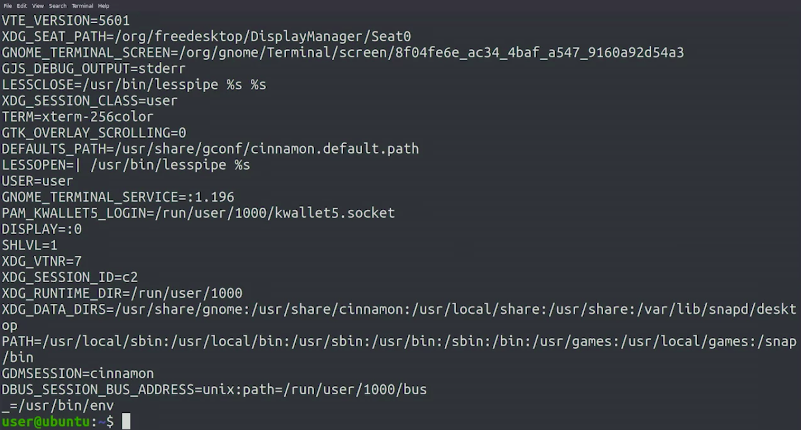</a>
		</p>
		* Some are more important than others
			* For example, the __path variable__ is a very important one
				```shell
				>>> echo $PATH
					<CHECK IMAGE FOR OUTPUT>
				```
				<p align="center">
				  <a href="javascript:void(0)" rel="noopener">
					 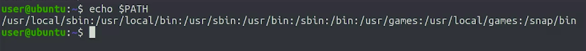</a>
				</p>
				* When we want to access the value of the variable in the shells, we need a prefix and name of the variable with a dollar sign
				* The shell uses this environment variable to figure out where to look for executable files, and we call them while specifying a directory
					* All those directories listed there are where the shell will look for programs
				* For example
					* when we call the __Python 3 program__, the shell checks each of the __directories listed__ in the __path variable__ in order, and when it finds a program called Python 3, it executes it
* __echo__ is a command that we use to print texts and Linux shell
* We can read the contents of these variables from Python
	```python
	>>> import os
	>>> 
	>>> print('HOME: ' + os.environ.get('HOME', ''))
	>>> print('SHELL: ' + os.environ.get('SHELL', ''))
	>>> print('FRUIT: ' + os.environ.get('FRUIT', ''))
	```
	* To access environment variables, we use the __environ dictionary__ provided by the __OS module__
		* The __get()__ method is a bit similar to how we've been accessing dictionary values up until now
			* The difference is what happens when the value isn't present
			* When we retrieve a value from a dictionary using the key as in os.environ['FRUIT'] and the __key isn't present__, we get an __error__
			* If we use a __get()__ method instead, we can __specify__ what __value__ should be __returned__ if the __key isn't present__
				* In other words, the __get()__ method allows us to specify a default value when the key that we're looking for isn't in the dictionary
	* So what we're asking Python to do is try to retrieve the value associated with the key, but if the key's not defined return an empty string instead
			<p align="center">
			  <a href="javascript:void(0)" rel="noopener">
				 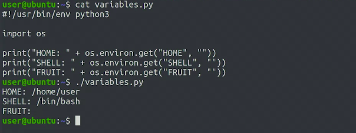</a>
			</p>
		* We got the values for HOME and SHELL, but not for FRUIT. Well, that's because that variable isn't defined in the current environment
	* To define FRUIT variable in a way that our script we'll be able to see it, we need to run below command in our command-line
		```shell
		>>> export FRUIT=Pineapple
		```
		* We define the variable by just setting a value using the equal sign and leaving no spaces in between
		* Along with this, the export keyword tells a shell that we want the value we set to be seen by any commands that we call
	* Running python script again for getting environment variable
		```python
		>>> import os
		>>> 
		>>> print('HOME: ' + os.environ.get('HOME', ''))
		>>> print('SHELL: ' + os.environ.get('SHELL', ''))
		>>> print('FRUIT: ' + os.environ.get('FRUIT', ''))
		```
		<p align="center">
		  <a href="javascript:void(0)" rel="noopener">
			 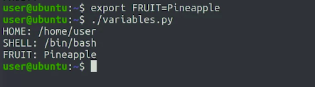</a>
		</p>

> __`/usr/sbin/temp`__ is not listed in PATH variable by default

### Command-Line Arguments and Exit Status

* __Command Line Arguments__ - These are parameters that are passed to a program when it started
	* It's a super common practice to make our scripts receive certain values by command line arguments
	* It allows a code of the script to be generic while also letting us run it automatically without requiring any interactive user input
	* We can specify the information that we want our program to use before it even starts
* In Python, we can access these values using the __argv__ list in the __sys module__
	```python
	>>> import sys
	>>> print(sys.argv)
	```
	* Our script just imports the __sys module__ and prints the __sys.argv__ list
	* In case, we called the script without any parameters
			<p align="center">
			  <a href="javascript:void(0)" rel="noopener">
				 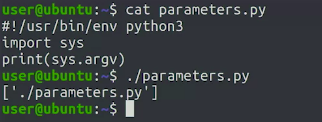</a>
			</p>
		* The list contains one single element
			* The name of the program that we just executed
	* Calling script with some parameters
			<p align="center">
			  <a href="javascript:void(0)" rel="noopener">
				 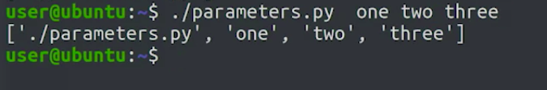</a>
			</p>
		* We see that each of the parameters that we pass is included as a separate element in the list
* The __Exit Status__ is a value returned by a program to the shell
	* In all Unix-like operating systems, the exit status of the process is zero when the process succeeds and different than zero if it fails
	* The actual number returned gives additional info on what kind of error the program encountered
	* Knowing if a command finish successfully or not is helpful information which can be used by a program that's calling a command
	* For example
		* it can use the information to retry the command. If it failed
	* __Question Mark Variable__ - is used to check the exit status of a program, it lets us see what the exit status of the last executed command was
		* So to see the __contents__ we use __dollar sign question mark__ __`$?`__
	* Example
		1. Using __wc__ command to check how exit status works : success status Example
				<p align="center">
				  <a href="javascript:void(0)" rel="noopener">
					 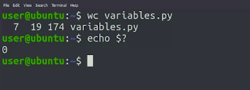</a>
				</p>
				* So here we first ran the __wc__ command and it printed the values of lines, words and characters for our Python script
				* Then we printed the contents __dollar sign question mark__ variable __`$?`__, and we can see that the __exit value__ was __zero__
					* That's because __wc__ command ran successfully
		1. Using __wc__ command to check how exit status works : failed status Example
				<p align="center">
				  <a href="javascript:void(0)" rel="noopener">
					 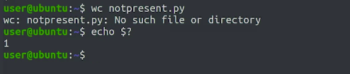</a>
				</p>
			* Here __wc__ command couldn't run for the file that we pass because it doesn't exist
			* The command printed an error and when printing the contents of the dollar sign question mark variable, we see that it finished with an exit value of one
	* __When a Python script finishes successfully, it exits with an exit value of zero__
		* When it finishes with an error like type error or value error, it exits with a different value than zero
		* We can make it exit with whatever value is relevant
		* Example
				<p align="center">
				  <a href="javascript:void(0)" rel="noopener">
					 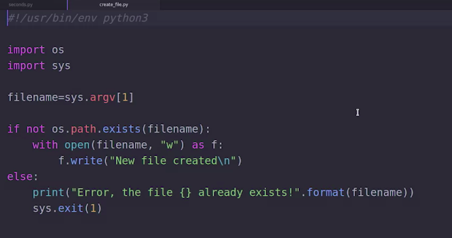</a>
				</p>
			* This script receives a file name as a command line argument
			* It first checks whether the file name exist or not
			* When the file doesn't exist, it creates it by writing a line to it
			* When the file exist, our script print an error message and exits with an exit value of one
			* CASE WHEN FILE DOES NOT EXIST : Success condition : It will create a new file
					<p align="center">
					  <a href="javascript:void(0)" rel="noopener">
						 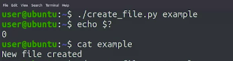</a>
					</p>
				* Check out how it exited with the exit code zero even though we didn't specify this in the code
					* That's because that's the default behavior
			* CASE WHEN FILE ALREADY EXIST : Fail condition : Raises error when file already present
					<p align="center">
					  <a href="javascript:void(0)" rel="noopener">
						 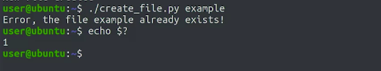</a>
					</p>
				* We get an error because the file already exists and so we get an exit code of one
* We'll use command line parameters to tell our programs what we want them to do without having to interact with them
* We'll use exit values to know if our command succeeded or failed and then log failures and automatically retry the commands if we need to

## Python Subprocesses

### Running System Commands in Python

* Python provides a way to execute system commands in our scripts, using functions provided by the __subprocess module__
* Example
	```python
	>>> import subprocess
	>>> subprocess.run(['date'])
		Tue 07 Jan 2020 02:34:44 PM PST
		Completed Process(args=['date'], returncode=0)
	```
	* The __run()__ function returns an object of the Completed Process type
		* This __object includes information__ related to the execution of the __command__
		* From the information that got printed we can see that the __returncode__ of the command was __0__
	* To run the external command a secondary environment is created for the child process or subprocess where the command is executed
	* While the parent process, which is our script, is waiting on the subprocess to finish, it's blocked, which means that the parent can't do any work until the child finishes
					<p align="center">
					  <a href="javascript:void(0)" rel="noopener">
						 </a>
					</p>
	* After the external command completes its work, the child process exits and the flow of control returns to the parent
	* Then the script can continue with normal execution
* Example: __sleep__ command
	```python
	>>> import subprocess
	>>> subprocess.run(['sleep', '2'])
		Completed Process(args=['sleep', '2'], returncode=0)
	```
	* While the sleep command was running, the interpreter was blocked and we couldn't interact with it
	* The run function receives a list that starts with the name of the command that we want to call, followed by any other parameters that we want to pass to that command
		* So any elements following the program name are the command-line arguments for it
		* In this case, we're requesting sleep to wait for two seconds
* Example : Exit Status != 0
	* If we call __ls__ with a file name that doesn't exist, __ls__ will print an error and return an exit status different than __0__
	* This will be stored in the return code attribute of the completed process instance
		```python
		>>> import subprocess
		>>> result = subprocess.run(['ls', 'this_file_does_not_exist'])
			ls: cannot access 'this_file_does_not_exist': No such file or directory
		>>> print(result.returncode)
		```
		* We can see that the command failed and the returncode stored was 2, letting us know that there was an error
		* We could use this information in the script to do something different in case the failure

### Obtaining the Output of a System Command

* To be able to process the output of commands, we'll set a parameter called **capture_output** to __True__ when calling the __run()__ function
* Example
	* We'll call the host command, which can convert a host name to an IP address and vice versa
	* When calling it, we'll pass the capture output equals true parameter and store the result in a variable so that we can access it
		```python
		>>> import subprocess
		>>> result = subprocess.run(['host', '8.8.8.8'], capture_output=True)
		>>> print(result.returncode)
			0
		>>> print(result.stdout)
			b'8.8.8.8.in-addr.arpa domain name pointer dns.google.\n' # 'b' tells us that this string is not a proper string for Python. It's actually an array of bytes
		>>> print(result.stdout.decode().split())
			['8.8.8.8.in-addr.arpa','domain','name','pointer','dns.google.']
		```
		* We know that the __result variable__ is a completed process instance that we can access
			* We can check the return code attribute
		* We can also print and operate with the output generated by the command, which is stored in the __stdout__ attribute
			* 'b' tells us that this string is not a proper string for Python
				* It's actually an __array of bytes__
				* Python doesn't know which encoding to use to process the output of the command. So it simply represents it as a series of bytes
				* If we want this to become a proper string, we can call the __decode()__ method
					*  This method applies an encoding to transform the bytes into a string
	* If we use the capture output parameter and the command writes any output to __standard error__, it will be stored in the __stderr__ attribute of the completed process instance
		```python
		>>> import subprocess
		>>> result = subprocess.run(['rm', 'does_not_exist'], capture_output=True)
		>>> print(result.returncode)
			1
		>>> print(result.stdout)
			b''
		>>> print(result.stderr)
			b"rm: cannot remove 'does_not_exist': No such file or directory\n"
		```
		* In this case, the __standard output__ __stdout__ was empty
		* But there was an error printed, a standard error which we can access through the __stderr__ attribute
* __Data__ in computers is stored and transmitted in __bytes__ and each can represent up to __256 characters__
	* But there are thousands of possible characters out there used to write in various languages
		* Chinese, for example, requires over 10,000 different characters
	* To be able to write in those languages, several specifications called encodings have been created over time to indicate which sequences of bytes represent which characters
	* Nowadays, most people use __UTF-8 encoding__, which is part of the Unicode standard that lists all the possible characters that can be represented

### Advanced Subprocess Management

* Code to Modify Environment Variable
	<p align="center">
	  <a href="javascript:void(0)" rel="noopener">
		 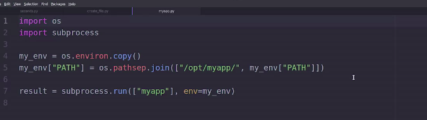</a>
	</p>
	* In this code, we start by calling the __copy()__ method of the __OS environ dictionary__ that contains the current environment variables
		* This creates a new dictionary that we can change as needed without modifying the original environment
	* The change that we're doing in this script is adding one extra directory to the path variable
	* __Remember__, the path variable indicates where the operating system will look for the executable programs
		* By adding one entry to the path, we're telling the OS to look for programs in an additional location
	* To create the new value, we're calling the __join()__ method on the os path substring
		* This joins elements of the list that we're passing with a path separator corresponding to the current operating system
		* So here, we're joining `/opt/myapp` and the old value of the path variable to the path separator
	* Finally, we call the myapp command, setting the end parameter to the new environment that we've just prepared
* Options that we can use with __run__ function
	1. __cwd__ parameter
		* the CWD parameter is used to change the current working directory where the command will be executed
		* This can be really helpful when working with a set of directories where you need to run a command on each of them
	1. __timeout__ parameter
		* This will cause the run function to kill the process if it takes longer than a given number of seconds to finish
		* This might be useful if you're running a command that you know might get stuck
		* For example, if it's trying to connect to a network and your computer is offline
	1. __shell__ parameter
		* If we set this to true, Python will first execute an instance of the default system shell and then run the given command inside of it
		* This means our command line could include variable expansions and other shell operations
			* Without the shell parameter, this would not be possible
		* Keep in mind that if you need to expand variables or globs, you'll need to set this parameter
		* But using this can be a security risk. So make sure you actually need it and be careful when using it if you do
* Interfacing the underlying system directly in your Python scripts via subprocesses and system commands can be useful especially if you need to do a specific task quickly
	* But it comes with some drawbacks
		1. Using these system-level commands built assumptions into our scripts about the infrastructure, our automation will run on
			1. If those assumptions change, it can lead to unexpected effects or failures
			1. These kinds of assumptions can change in multiple ways
				* What would happen to our automation is the flags where terminal command change and our script continues to use the old flags?
				* What happens if we switch operating systems from Linux to Windows?
				* Will our scripts fail outright or will they succeed in unintended and possibly harmful ways?
	* Any change to the system or external commands our scripts use increases the chances of something breaking
* If we're automating a one-off, well-defined task, we're developing a solution quickly is the biggest requirement, then using system commands and subprocesses can help a lot
	* But if we're doing something more complex or long-running, it's usually a good idea to use the bait in or external modules that Python provides
	* So before deciding to use a sub processes, it's a good idea to check the standard library or pypi repository to see if we can do the task with native Python and to check if someone has already created the automation that we wanted to write


## Processing Log Files

### What are log files?

* The different events that happen in programs that are running in a system and aren't connected to terminal are usually rent log files
	<p align="center">
	  <a href="javascript:void(0)" rel="noopener">
		 </a>
	</p>
* Log files contain a lot of useful information, particularly when you're trying to debug a tricky problem that's happening on a computer
	<p align="center">
	  <a href="javascript:void(0)" rel="noopener">
		 </a>
	</p>
* On the flip side, sometimes it can be overwhelming to try to find something inside of a log file that contains a whole lot of lines with a whole lot of things in them
* So it's a good idea to learn how we can process these files and get our tools to extract information that we want out of them
* Using regex's in our scripts gives us a great deal of flexibility when processing log files and other texts data sources too
* In a script, we can program any kind of behavior we want, so we can manipulate and process text data and get results we need

### Filtering Log Files with Regular Expressions

* __Remember__ that for performance reasons, when files are large, it's generally a good practice to read them line by line instead of loading the entire contents into memory
* __Cron Jobs__ are used to schedule scripts on UNIX-based operating systems
* __Continue__ keyword tells our loop to go to the next element
	* So if the line doesn't contain a string that we're looking for, we'll skip it and go to the next line
* Sample Data
	<p align="center">
	  <a href="javascript:void(0)" rel="noopener">
		 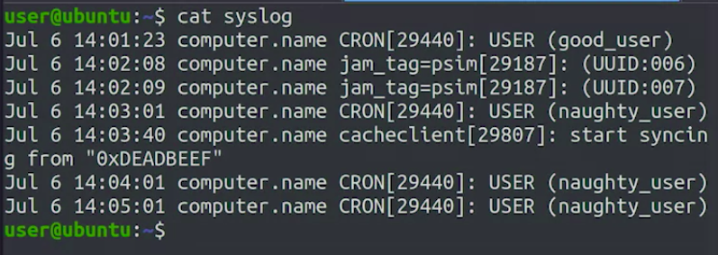</a>
	</p>
* Example
	1. The server that generates log file (sample image above) has been acting strangely and we suspect it's due to a Cron job started by one of the system administrators
		* To find out what's happening with the server, we want to audit the log files and see exactly who's been launching CRON jobs
			```python
			>>> import re
			>>> import sys
			>>> 
			>>> logfile = sys.argv[1]
			>>> with open(logfile) as f:
			>>>     for line in f:
			>>>         if "CRON" not in line:
			>>>             # continue keyword tells the loop to go to the next element
			>>>             continue
			>>>         pattern = r"USER \((\w+)\)$"
			>>>         result = re.search(pattern, line)
			>>>         print(result[1])
			```
			* Since the username is found at the end log line, we use the dollar sign anchor to only match texts that is at the end of the line
			* To find the username, we look for the word user followed by a string wrapped in parentheses as that's how these lines are structured
				* This means that we need to escape those parentheses with a backslash
			* Since we want to extract the actual username, we use another couple of parentheses to create a __capturing group__
			* For the username itself, we're matching any alphanumeric characters by using __backslash w plus__ `\w+`
				<p align="center">
				  <a href="javascript:void(0)" rel="noopener">
					 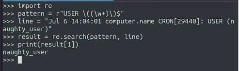</a>
				</p>
			* Output of above mentioned python script
				<p align="center">
				  <a href="javascript:void(0)" rel="noopener">
					 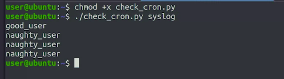</a>
				</p>
* We're using the same syslog, and we want to display the date, time, and process id that's inside the square brackets. We can read each line of the syslog and pass the contents to the show_time_of_pid function. Fill in the gaps to extract the date, time, and process id from the passed line, and return this format: Jul 6 14:01:23 pid:29440.
	```python
	>>> import re
	>>> def show_time_of_pid(line):
	>>> 	#(parenthesis) creates groups, here there will be 
	>>> 	#    two groups with subcript (1) and (2)
	>>> 	# pattern = r"(\w+ \d+ [\d:]+).*\[(\d+)\]"
	>>> 	# pattern = r'(^.+:[0-9]{2}\b).+\[(\d*)\]'
	>>>		# pattern = r"^([\w :]+) .*\[(\d+)\]"
	>>> 	pattern = r"([a-zA-Z]+ \d+ \d+:\d+:\d+).*\[(\d+)\]\:"
	>>> 	result = re.search(pattern, line)
	>>> 	return "{} pid:{}".format(result.group(1), result.group(2))
	>>> 
	>>> print(show_time_of_pid("Jul 6 14:01:23 computer.name CRON[29440]: USER (good_user)")) # Jul 6 14:01:23 pid:29440
		Jul 6 14:01:23 pid:29440
	>>> print(show_time_of_pid("Jul 6 14:02:08 computer.name jam_tag=psim[29187]: (UUID:006)")) # Jul 6 14:02:08 pid:29187
		Jul 6 14:02:08 pid:29187
	>>> print(show_time_of_pid("Jul 6 14:02:09 computer.name jam_tag=psim[29187]: (UUID:007)")) # Jul 6 14:02:09 pid:29187
		Jul 6 14:02:09 pid:29187
	>>> print(show_time_of_pid("Jul 6 14:03:01 computer.name CRON[29440]: USER (naughty_user)")) # Jul 6 14:03:01 pid:29440
		Jul 6 14:03:01 pid:29440
	>>> print(show_time_of_pid("Jul 6 14:03:40 computer.name cacheclient[29807]: start syncing from \"0xDEADBEEF\"")) # Jul 6 14:03:40 pid:29807
		Jul 6 14:03:40 pid:29807
	>>> print(show_time_of_pid("Jul 6 14:04:01 computer.name CRON[29440]: USER (naughty_user)")) # Jul 6 14:04:01 pid:29440
		Jul 6 14:04:01 pid:29440
	>>> print(show_time_of_pid("Jul 6 14:05:01 computer.name CRON[29440]: USER (naughty_user)")) # Jul 6 14:05:01 pid:29440
		Jul 6 14:05:01 pid:29440
	```

### Making Sense out of the Data

* Problem Statement : Have a count of how many times each username appears in our log.
* Dictionaries are great structure to use when we want to count appearances of strings
* Example
				<p align="center">
				  <a href="javascript:void(0)" rel="noopener">
					 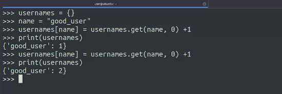</a>
				</p>
* Code to solve our problem statement
	```python
	>>> import re
	>>> import sys
	>>> 
	>>> logfile = sys.argv[1]
	>>> usernames = {}
	>>> with open(logfile) as f:
	>>> 	for line in f:
	>>> 		if "CRON" not in line:
	>>> 			# continue keyword tells the loop to go to the next element
	>>> 			continue
	>>> 		pattern = r"USER \((\w+)\)$"
	>>> 		result = re.search(pattern, line)
	>>> 		if result is None:
	>>> 			continue
	>>> 		name = result[1]
	>>> 		usernames[name] = usernames.get(name, 0) + 1
	>>> print(usernames)
	```
	<p align="center">
	  <a href="javascript:void(0)" rel="noopener">
		 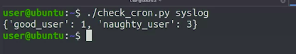</a>
	</p>
	* Our script allows us to very quickly see who's been starting cron jobs in the server and at what frequency
		* Now we can use the information to investigate the issue more deeply


> The __continue statement__ is used to return control back to the top of a loop
#
> Since log files can get pretty large, it's a good idea to parse them one line at a time instead of loading the entire file into memory at once
#
> We can save a lot of time by not parsing lines that don't contain what we need
#
> Before we can parse our log file, we have to use the __open()__ or __with open()__ command on the file first

