Using Python to Interact with the Operating System
==================================================

by Google

# Module 5
#
## Title: Testing in Python

## Simple Tests

### What is testing?

* When you're writing a very simple piece of code, say for example, that you're adding two variables, it's pretty straightforward to know what the code does, and be sure they'd does it correctly
* As operations become more complex using loops, conditionals, calling more and more functions, it's harder to really be confident that the code will do what it's supposed to
	* This is where software testing comes into play
* __Software testing__ is a process of evaluating computer code to determine whether or not it does what you expect it to do
	* When you test a piece of software, you want to find the errors and defects and see where things go wrong
	* Software testing is similar in lots of ways to the tests performed in the manufacturing process of a new piece of machinery
		* When a new car comes off the line, you want to make sure that when you press the gas the car will go, and when you press the brakes the car will stop
	* You want to make sure that when you run a program, it behaves the way that it should
			<p align="center">
			  <a href="javascript:void(0)" rel="noopener">
				 </a>
			</p>
		* Scripts and programs can fail in all sorts of strange ways, especially as it become more complicated
		* In all but those simple programs, it's next to impossible to test for everything that could go wrong
		* Even though this means that a certain number of bugs might exist in your scripts without you realizing it
		* Writing tests can help you eliminate a whole bunch of bugs, helping to improve the reliability and the quality of automation
* __Tests__ can help make good code great
* We'll explore some fundamental concepts involved like
	1. automated testing
	1. unit test
	1. integration test
	1. test-driven development

### Manual Testing and Automated Testing

* One of the tasks that programmers had to do when writing code is test it to make sure that it behaves the way that they expected to
* Having good tests for our software can help us catch mistakes, errors, and bugs before we deploy our scripts to perform real-world automation tasks
* The most basic way of testing a script is to run it with different parameters and see if it returns the expected values
* __Manual Testing__
	* Executing a script with different command-line arguments to see how its behavior changed is an example of __manual testing__
	* Using the interpreter to try our code before putting it in a script is another form of manual testing
			<p align="center">
			  <a href="javascript:void(0)" rel="noopener">
				 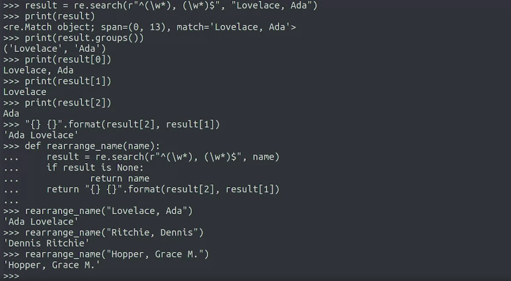</a>
			</p>
* __Automated Testing__
	* Formal software testing takes us process a step further, codifying tests into its own software and code that can be run to verify that our programs do what we expect them to do
		* This is called __automatic testing__
	* The goal of automatic testing is to automate the process of checking if the returned value matches the expectations
	* Instead of us humans running a function over and over with different parameters and checking the results are what we expected them to be, we let the computer do this for us
	* __Automatic testing means we'll write code to do the test__
* Why would you write more code to test code you have?
	* Because when you're testing your code, you want to check if it does what it's supposed to do for a lot of different values
	* You ought to verify that it behaves the way you expect it to have as many possible values known as __test cases__
* __Example__
	* Say you're writing a script that updates a list of email addresses to use a new domain
		* You'll want to test what happens when your list of emails has one element, two elements, or 10 elements
		* You want to test what happens if the new domain is one character long, or 20 characters long, or even an empty string
		* You'll also want to test what happens if the list contains
			1. only emails that need to be updated
			1. only emails that don't need to be updated
			1. a mix of them
	* As you can see the list of things that you want to test for can get very long, very fast
	* The more test cases that you include in your test, the better tested your code is and the more you can guarantee that your code does what you expect it to do
	* If we're testing this manually, it's unlikely that we'll go through all the cases whenever we change our code
		* We'll test just a few, possibly, letting a bug slipped through. Not ideal
		* This is why we don't want to perform these tests manually and instead, want to make a computer do it for us
* Just like with any example of automation, the advantage of automatic tests is that we can run them as many times as necessary and will always get the same results
* The computer will do the same checks over and over and we'll always make sure that the return value matches our expectation
* When for some reason the results don't match the expectations, the code will raise an error, so we can check the code and find out what's going on

> Test cases automatically test with a range of possible values to verify the program’s behavior
# 
> Software testing is the process of evaluating computer code to determine whether or not it does what you expect it to do, and the more complex the code, the more likely failure is
#
> Codifying tests into its own software and code that can be run to verify that our programs do what we expect them to do is automatic testing
#
> The most basic way of testing a script is to use different parameters and get the expected results

## Unit Tests

### Unit Tests

* The most common type is a __unit test__
* __Unit tests__ are used to verify that small isolated parts of a program are correct
* __Unit tests__ are generally written alongside the code to test the behavior of individual pieces or units like functions or methods
* __Unit tests__ help assure the developer that each piece of code does what it's meant to do
* An __important characteristic__ of a unit test is __isolation__
* __Unit test__ should only test the unit of code they target, the function or method that's being tested
	* This ensures that any success or failure of the test is caused by the behavior of the unit in question and doesn't result from some external factor like the network being down or a database server being unresponsive
	* In other words, when testing a function or method, we want to make sure that we're focusing on checking that the code in that function or method behaves correctly
	* We don't want our test to fail for external reasons
* Our tests should never modify the __production environment__
	* __Production Environment__ - This is a live environment that runs a software that users interact with
	* When developing test, if for any reason we do need to interact with some other software, we'll normally do that in a test environment, where we'll have control over how it behaves
* So the __goal__ of the __unit test__ is to verify that small, isolated parts of a program are correct
	* That is, for a given a known input, does the output of our code match our expectations 
* Example
	* Lets test a script rearrange.py
			<p align="center">
			  <a href="javascript:void(0)" rel="noopener">
				 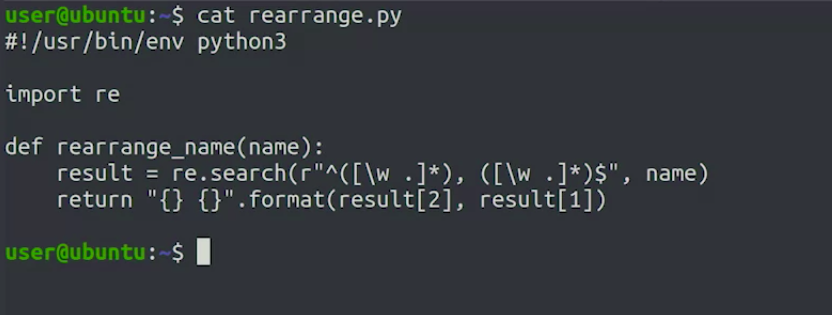</a>
			</p>
		* Let's start by manually validating that for a given input, it produces expected result
		* We'll check this by importing the function in an interpreter
			* To do that, we'll use a keyword that __from__, like shown below
				```python
				>>> from rearrange import rearrange_names
				>>> rearrange_names('Lovelace, Ada')
					Ada Lovelace
				```
			* In this case, rearrange is the name of the module that contains the rearrange_name function
			* By importing it in this way, we can call the function without having to write the module name each time we want to call it
			* The function has produced the output we expected, given the input we provided
				* So it has pass this particular unit test
* The test focus on a small isolated piece of the code and validated our assumption about how it worked
	* Because the scope of the test is restricted to a small specific unit, these types of tests usually run pretty quickly
	* Debugging them is simple since there are a limited number of reasons for them to fail
* Creating unit tests for our code will mean writing a bunch of test cases that verify that when we input some parameters, we get the output that we want

### Writing Unit Tests in Python

* We know that by having automatic tests, we can run them as many times as necessary to make sure that our code does what we want it to do
* We need to write some code that runs a test and verifies the output
	* This way, we can get our computer to do the work for us
* To demonstrate the testing workflow, we'll create unit tests for the rearrange_name function
	```python
	>>>	#!/usr/bin/env python3
	>>>	# Filename  : rearrange.py
	>>>	import re
	>>>	
	>>>	def rearrange_name(name):
	>>>		result = re.search(r"^([\w .]*), ([\w .]*)$", name)
	>>>		return "{} {}".format(result[2], result[1])
	```
	* Automatic tests are usually written alongside the code that we want to test
		* What this means in practice is creating a separate Python file with the test
		* The convention is to call the script with the same name of the module that it's testing and appending the suffix `_test`
	* So for our rearrange module, we'll create the rearrange_test.py file
	* We'll test the rearrange_name function of the rearrange module
		* So let's import that function the way we did before in the interpreter
			```python
			>>> from rearrange import rearrange_name
			```
	* Python provides a module called __unittest__
		* This module includes a number of classes and methods that let us easily create unit tests for our code
		* The first thing we'll do is import the __unittest module__ we'll need for testing
			* The __unittest module__ provides a test case class with a bunch of testing methods ready to use
			* To access this functionality, we create our own class by inherits from test case, thus inheriting all those testing methods
			* So we're going to write our own test rearrange class that inherits from test case
				```python
				>>> from rearrange import rearrange_name
				>>> import unittest
				>>>
				>>> class TestRearrange(unittest.TestCase):
				```
				* We called our test class, __TestRearrange__, and indicated that it should inherit functionality from the TestCase class located in the unit test module
				* Any methods we define in our __TestRearrange__ class that start with the __prefix test__ will automatically become tests that can be run by the testing framework
	* Let's turn a manual test into an automatic test that verifies that basic names are formatted correctly
		```python
		>>> from rearrange import rearrange_name
		>>> import unittest
		>>>
		>>> class TestRearrange(unittest.TestCase):
		>>> 	def test_basic(self):
		>>> 		testcase = "Lovelace, Ada"
		>>> 		expected = "Ada Lovelace"
		>>> 		self.assertEqual(rearrange_name(testcase), expected)
		>>>
		```
		* With this method which we've called __test_basic__, we kick off by setting up our expected inputs and outputs
		* We then use the __assertEqual()__ method provided to us by the test case class we inherited from to verify that what we expected is exactly what we got
			* The __assertEqual()__ method basically says both of my arguments are equal
				* If that statement's __true__, then the __test passes__
				* If it's __false__, the __test fails__ and an error is printed to the screen when the test is run
	* In the main part of our program, we'll call the unittest.main() function, which will run the test for us
		```python
		>>> # Filename  : rearrange_test.py
		>>> from rearrange import rearrange_name
		>>> import unittest
		>>>
		>>> class TestRearrange(unittest.TestCase):
		>>> 	def test_basic(self):
		>>> 		testcase = "Lovelace, Ada"
		>>> 		expected = "Ada Lovelace"
		>>> 		self.assertEqual(rearrange_name(testcase), expected)
		>>>
		>>> unittest.main()
		```
	* Let's make our script executable and then run it
		```shell
		>>> chmod +x rearrange_test.py
		>>>
		>>> ./rearrange_test.py
		```
		<p align="center">
		  <a href="javascript:void(0)" rel="noopener">
			 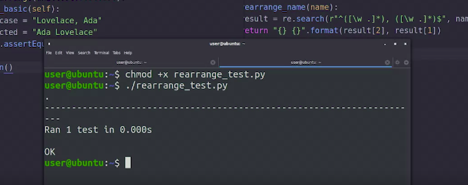</a>
		</p>
		* The output is pretty descriptive, printing out some information about how long a group of tests or test suite took to run
		* As well as the number of tests, and whether or not, they passed

### Edge Cases

* We should also see what happens when we give it some input that we may not expect it to run into under normal operations
	* For example, what would happen in our function if we gave it an empty string
		```python
		>>> # Filename  : rearrange_test.py
		>>> from rearrange import rearrange_name
		>>> import unittest
		>>>
		>>> class TestRearrange(unittest.TestCase):
		>>> 	def test_basic(self):
		>>> 		testcase = "Lovelace, Ada"
		>>> 		expected = "Ada Lovelace"
		>>> 		self.assertEqual(rearrange_name(testcase), expected)
		>>>
		>>> 	def test_empty(self):
		>>> 		testcase = ""
		>>> 		expected = ""
		>>> 		self.assertEqual(rearrange_name(testcase), expected)
		>>>
		>>> unittest.main()
		```
		* In this case we're testing for an empty input string
			* We're saying that we expect our function to return an empty string whenever it sees an empty string
			* We check this behavior by using the __assertEqual()__ function
				<p align="center">
				  <a href="javascript:void(0)" rel="noopener">
					 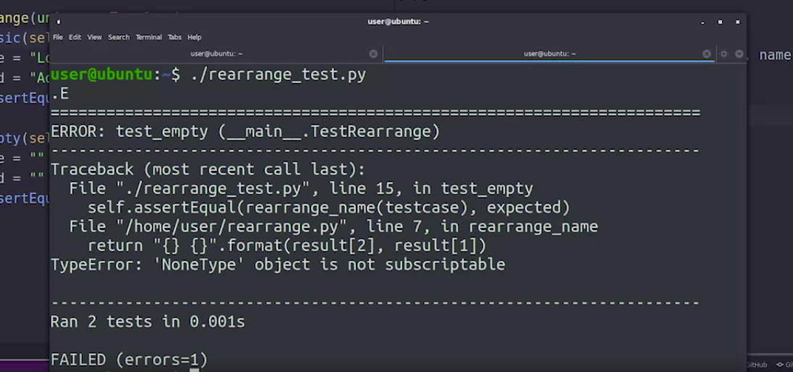</a>
				</p>
		* Our test failed
		* This error tells us that the test called **test_empty** failed
			* We see that it failed with a type error saying that none is not subscriptable
* __Edge Cases__ are inputs to our code that produce unexpected results, and are found at the extreme ends of the ranges of input we imagine our programs will typically work with
	* __Edge cases__ usually need special handling in scripts in order for the code to continue to behave correctly
* In our rearranging example, we can handle this edge case by performing a simple check of the result variable before operating with it
	```python
	>>>	#!/usr/bin/env python3
	>>>	# Filename  : rearrange.py
	>>>	import re
	>>>	
	>>>	def rearrange_name(name):
	>>>		result = re.search(r"^([\w .]*), ([\w .]*)$", name)
	>>> 	# added if statement - to account edge cases
	>>> 	if result is None:
	>>> 		return ""
	>>>		return "{} {}".format(result[2], result[1])
	```
	* With this change if we use our function for normal input we'll still get a result that we got before
		* If we try to use an empty string, we'll catch it with our check and return the original empty string instead
	* Whether or not we handle this kind of error depends on how we want the scripts to behave
		* In our specific case, returning the original value makes sense when we can't rearrange it
	* But sometimes you might actually want your program to crash with an error rather than to go on as if nothing happened
	* __Remember__ that it's bad for automation to fail silently
	* Lets run out test cases once again to check if the problem is fixed
		<p align="center">
		  <a href="javascript:void(0)" rel="noopener">
			 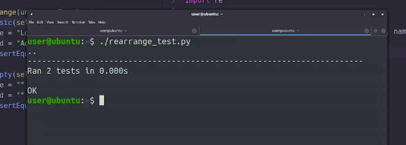</a>
		</p>
		* Our test passed
		* We fixed a bug in our code, and by adding an automatic test, we can make sure that it won't happen again
* __Other__ kinds of __edge cases__ usually include things like 
	1. passing zero to a function that expects a number
	1. negative numbers
	1. extremely large numbers
* These types of conditions are good to consider when writing your test, since they can cause your code to crash or behave in unexpected ways

### Additional Test Cases

* When we first wrote the function, we came across names with spaces or dots that will make our regular expression not match
	* We fixed that already but it's still a good idea to add a test case to make sure that our code still works how we expect it to
		```python
		>>> # Filename  : rearrange_test.py
		>>> from rearrange import rearrange_name
		>>> import unittest
		>>>
		>>> class TestRearrange(unittest.TestCase):
		>>> 	def test_basic(self):
		>>> 		testcase = "Lovelace, Ada"
		>>> 		expected = "Ada Lovelace"
		>>> 		self.assertEqual(rearrange_name(testcase), expected)
		>>>
		>>> 	def test_empty(self):
		>>> 		testcase = ""
		>>> 		expected = ""
		>>> 		self.assertEqual(rearrange_name(testcase), expected)
		>>>
		>>>		def test_double_name(self):
		>>> 		testcase = "Hopper, Grace M."
		>>> 		expected = "Grace M. Hopper"
		>>> 		self.assertEqual(rearrange_name(testcase), expected)
		>>> 
		>>> unittest.main()
		```
		* In this case, we're testing that someone with more than one given name still gets their name properly rearranged
		* Let's run a test suite and see if it passes or not
			<p align="center">
			  <a href="javascript:void(0)" rel="noopener">
				 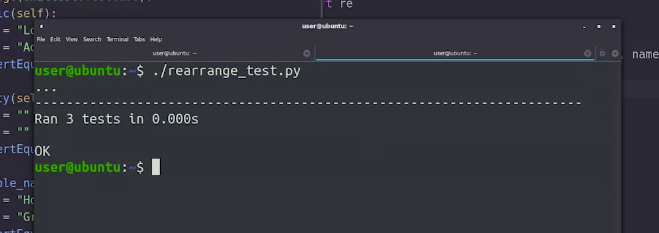</a>
			</p>
			* We now have 3 tests and all of them pass
	* Check code for someone who has only one name
		```python
		>>> # Filename  : rearrange_test.py
		>>> from rearrange import rearrange_name
		>>> import unittest
		>>>
		>>> class TestRearrange(unittest.TestCase):
		>>> 	def test_basic(self):
		>>> 		testcase = "Lovelace, Ada"
		>>> 		expected = "Ada Lovelace"
		>>> 		self.assertEqual(rearrange_name(testcase), expected)
		>>>
		>>> 	def test_empty(self):
		>>> 		testcase = ""
		>>> 		expected = ""
		>>> 		self.assertEqual(rearrange_name(testcase), expected)
		>>>
		>>>		def test_double_name(self):
		>>> 		testcase = "Hopper, Grace M."
		>>> 		expected = "Grace M. Hopper"
		>>> 		self.assertEqual(rearrange_name(testcase), expected)
		>>> 
		>>> 	def test_one_name(self):
		>>> 		testcase = "Voltaire"
		>>> 		expected = "Voltaire"
		>>> 		self.assertEqual(rearrange_name(testcase), expected)
		>>> 
		>>> unittest.main()
		```
		* In this case this person only has one name, so there's no comma in our string
		* We expect the result to be the same name we provided to the function
				<p align="center">
				  <a href="javascript:void(0)" rel="noopener">
					 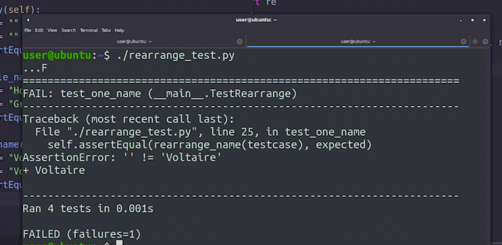</a>
				</p>
			* This one failed
			* It shows the name of the test that failed, which is test_one_name, we see an assertion error which means the original unexpected values don't match
				* It looks like our function return an empty string instead of the original name
		* Fixing code to squash this bug
			* What's happening now is that we're passing a name that doesn't include a comma, which makes a result variable none, and so the function is returning an empty string
			* The fix for this is pretty simple. Instead of returning an empty string when the result is none, we'll return the original name variable
				```python
				>>>	#!/usr/bin/env python3
				>>>	# Filename  : rearrange.py
				>>>	import re
				>>>	
				>>>	def rearrange_name(name):
				>>>		result = re.search(r"^([\w .]*), ([\w .]*)$", name)
				>>> 	if result is None:
				>>> 		return name  # this is the fix, return variable 'name' when result is None
				>>>		return "{} {}".format(result[2], result[1])
				```
				* Lets run out test cases once again to check if the problem is fixed
						<p align="center">
						  <a href="javascript:void(0)" rel="noopener">
							 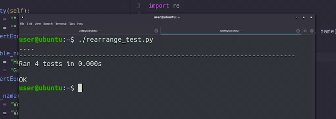</a>
						</p>
					* We fixed all the bugs and all our tests passed
					* One of the great things about running tests in a suite like this, is that we now know that all the test cases we wrote were handled correctly
					* Our code works for basic names, empty strings, double names, and single names
					* If we found another case that made our tests break, we could add it to the suite, fix the bug, and then run the whole suite again, being assured that all the other cases are still working
* Understand basic assertions:
	|Method|Checks that|New in|
	|:---:|:---:|:---:|
	|assertEqual(a, b)|a == b||
	|assertNotEqual(a, b)|a != b||
	|assertTrue(x)|bool(x) is True||
	|assertFalse(x)|bool(x) is False||
	|assertIs(a, b)|a is b|3.2|
	|assertIsNot(a, b)|a is not b|3.2|
	|assertIsNone(x)|x is None|3.2|
	|assertIsNotNone(x)|x is not None|3.2|
	|assertIn(a, b)|a in b|3.2|
	|assertNotIn(a, b)|a not in b|3.2|
	|assertIsInstance(a, b)|isinstance(a, b)|3.2|
	|assertNotIsInstance(a, b)|not isinstance(a, b)|3.2|


## Other Test Concepts

### Black Box vs. White Box

* __White-box__ testing also sometimes called __clear-box__ or __transparent__ testing relies on the test creators knowledge of the software being tested to construct the test cases
	* With a white-box test, the test creator knows how the code works and can write test cases that use the understanding to make sure that everything is performing the way it's expected to
* In __black-box__ testing, the software being tested is treated like an opaque box
	* In other words, the tester doesn't know the internals of how the software works
	* __Black-box__ tests are written with an awareness of what the program is supposed to do, its requirements or specifications, but not how it does it
	* For example
		1. a simple black-box test could be to verify that when you type www.google.de in your browser, the Google Search page for Germany is returned
			* You might not know how Google's servers process your request but you know what the end result should be
						<p align="center">
						  <a href="javascript:void(0)" rel="noopener">
							 </a>
						</p>
* Both white-box and black-box tests have their own __advantages__
	* __White-box__ tests are helpful because a test writer can use their knowledge of the source code to create tests that cover most of the ways that the program behaves
	* __Black-box__ tests are useful because they don't rely on the knowledge of how the system works
		* This means their test cases are less likely to be biased by the code
		* They usually cover situations not anticipated by the programmer who originally wrote the script
* Not all tests that we write needs to fall to one category or the other
* We can write unit tests that are either white or black-box, depending on which testing methodology is chosen
* __Black Box Unit Test__ : If the unit tests are created before any code is written based on specifications of what the code is supposed to do, they can be considered __black-box unit test__
* __White Box Unit Tests__: If unit tests are run alongside or after the code has been developed, the test cases are made with a knowledge of how software works. They are __white-box unit tests__
* As an IT specialist, you may need to test that software written by others behaves the way you expect it to
	* To do this, you can use the combination of black-box and white-box test
	* Example
		* Let's say that you have an online catalog of products that are sold by your company
			* You could have a __black-box test__ that verifies that the details for a product are displayed when you open the page for a specific product
			* Apart from that, you can have __white-box tests__ that calls the different functions used by that page, checking that the prices are displayed in the right currency, that the description is correctly wrapped and so on

### Other Test Types

* When we looked at unit tests, we call out they should focus on one specific unit, a functional method that being tested
	* This allows the test to verify the unit provides expected functionality regardless of the rest of the environment
* __Integration Tests__
	* __Integration Tests__ verify that the interactions between the different pieces of code in integrated environments are working the way we expect them to
						<p align="center">
						  <a href="javascript:void(0)" rel="noopener">
							 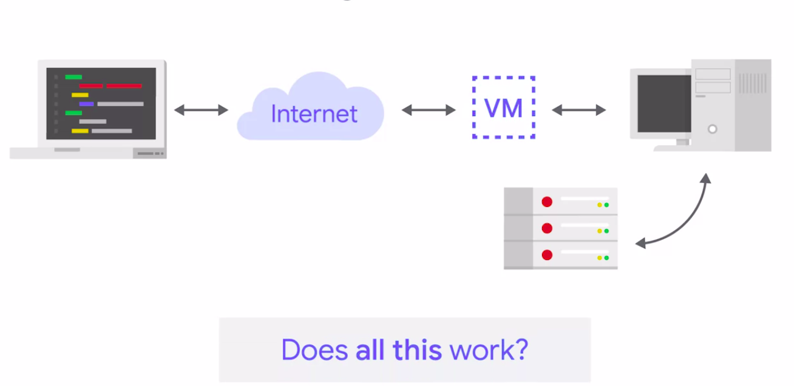</a>
						</p>
	* While __unit tests__ __shouldn't__ cross boundaries to do things like make a __network request__ or integrate with an __API__ or __database__, the goal of an __integration test__ is to __verify__ these kinds of __interactions__ and make sure the whole system works how you expect it to
	* __Integration test__, usually __take__ the __individual modules__ of code that unit test verify then combine them into a group to test
	* Depending on what our program does, and how it interacts with the rest of the systems involved, we might need to create a separate test environment for our test
		* Which runs a test version of our software that we're trying to verify
	* We might be able to run our test against the actual version of our system that's running, but that's only if our code doesn't make any changes to the production environment
	* __Integration tests__ will help make sure that all the pieces come together the way you expect them to
	* For Example
		* if the service you're trying to test interacts with a database, you want to set up a separate test database with a test user and a test tables
			* This lets you run all tests you need in an environment that you can control without risking modifying the production database
* __Regression Tests__
	* A variant of unit tests our __Regression Tests__
		* They're usually written as part of a debugging and troubleshooting process to verify that an issue or error has been fixed once it's been identified
		* Example
			* Say our script has a bug and we're trying to fix it
							<p align="center">
							  <a href="javascript:void(0)" rel="noopener">
								 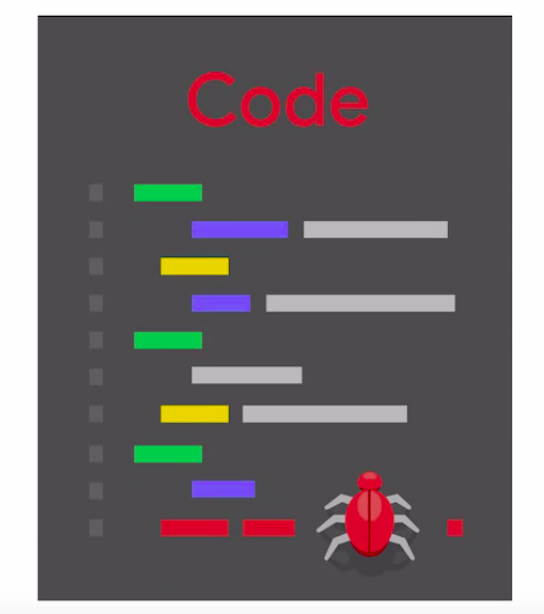</a>
							</p>
				* A good approach to doing this would be the first right to test fails by triggering the buggy behavior, then fix the bug so that a test passes
							<p align="center">
							  <a href="javascript:void(0)" rel="noopener">
								 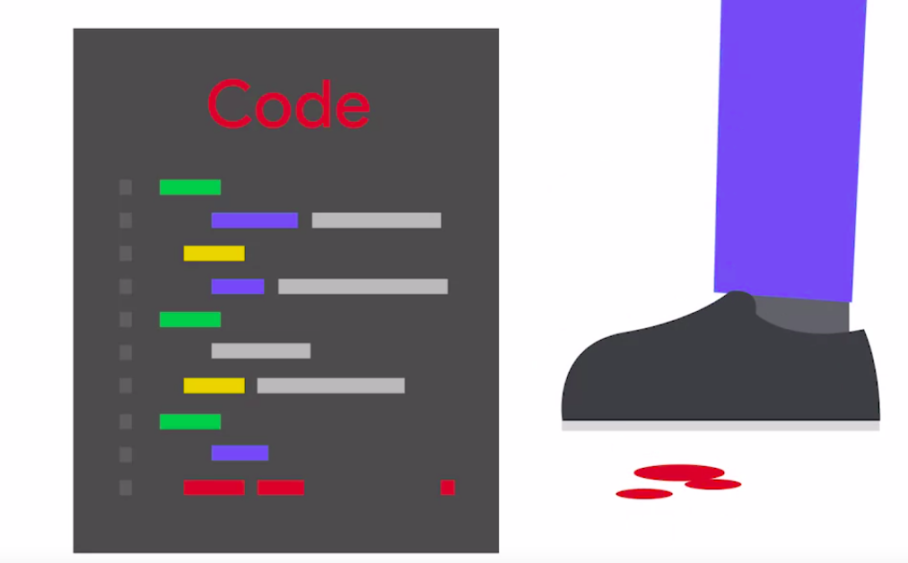</a>
							</p>
		* __Regression tests__ are useful part of a test suite because they ensure that the same mistake doesn't happen twice
		* The same bug can't be reintroduced into the code because introducing it will cause the regression test to fail
* __Smoke Test__ or __Build Verification Test__
	* __Smoke Test__ sometimes called __Build Verification Test__, get their name from a concept that comes from testing hardware equipment
		* Plug in the given piece of hardware and see if smoke starts coming out of it
	* When writing software smoke test serve as a kind of sanity check to find major bugs in a program
	* Smoke test answer basic questions like, does the program run?
	* These tests are usually run before more refined testing takes place
		* Since if the software fails the smoke test you can be pretty sure none of the other tests will pass either
							<p align="center">
							  <a href="javascript:void(0)" rel="noopener">
								 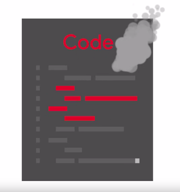</a>
							</p>
	* Examples
		1. For a web service the smoke test would be to check if there's a service running on the corresponding port
		1. For an automation script, the smoke test would be to run it manually with some basic input and check that the script finishes successfully
* __Load Test__
	* These tests verify that the system behaves well when it's under significant load
							<p align="center">
							  <a href="javascript:void(0)" rel="noopener">
								 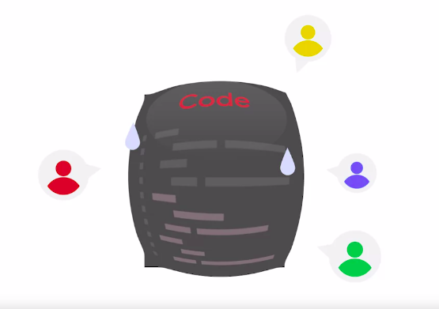</a>
							</p>
	* To actually perform these tests will need to generate traffic to our application simulating typical usage of the service
	* These tests can be super-helpful when deploying new versions of our applications to verify that performance does not degrade
	* For Example
		* We might want to measure the response time of our website while there are 100 requests per second on our pages, or a 1000, or 10,000
			* The actual numbers will depend on the expectations of how much traffic our website will receive
* __Test Suite__
	* Taking together a group of tests of one or many kinds is commonly referred to as a __test suite__
	* A good diversity of test types can create a more robust __test suite__ that helps ensure your scripts and automation, do what you tell them to

### Test-Driven Development

* A process called __test-driven development__ or __TDD__ calls for creating the test before writing the code
	* This might seem a bit counter-intuitive, but it can make for more __thoughtful well-written programs__
	* But creating some tests first make sure that you've thought about the problem that you're trying to solve and some different approaches that you might use to accomplish it
	* Writing a test first also helps you think about the ways your program could fail and break which can lead to some valuable insights and even change the approach you take for the better
* The test-driven development cycle typically involves
	1. First writing a test then running it to make sure it fails
		* After all, you haven't written the code to make it passed yet
	1. Once you've verified it fails, you write the code that will satisfy the test then run the tests again
	1. If it passes you can continue on to the next part of your program
	1. If it fails you Debug and run the test again
			<p align="center">
			  <a href="javascript:void(0)" rel="noopener">
				 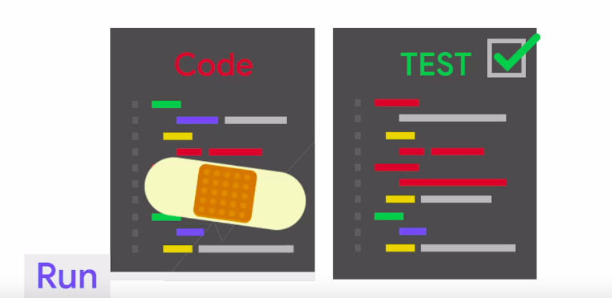</a>
			</p>
		* **NOTE:** The cycle is repeated for each new feature of your script until it's up and running
* __Continuous Integration__
	* Many companies take testing a step further and combine it with our version control systems and development processes
	* When engineers submit their code, it's integrated into the main repository and tests are automatically run against it to spot bugs and errors in a process called __Continuous Integration__
	* Although useful, setting up a continuous integration process can be a big undertaking
* __NOTE:__ good tests help make any automation and script you write more robust, resilient, and less buggy

> __Regression testing__ is a type of software test used to confirm that a recent program or code change has not adversely affected existing features, by re-executing a full or partial selection test cases
#
> __Load testing__ verifies the behavior of the software remains consistent under conditions of significant load
#
> By ensuring the unit of code we are testing is __isolated__, we can ensure we know where the bug originated
#
> __Integration test__ verifies that the different parts of the overall system interact as expected

## Errors and Exceptions

### The Try-Except Construct

* We've encountered errors generated by the interpreter a bunch of times
	* We've seen examples of TypeError, IndexError, ValueError, and others
* Up to now whenever the interpreter threw one of these errors we changed our code to avoid the error
* **Try-Except Construct**
	* The **try block** lets you test a block of code for errors
	* The **except block** lets you handle the error
	* Example
		* Our character_frequency function here reads the contents of a file to count the frequency of each character in them
		* To do that, the first step is to open the file
			* In this example, we've put the call to the open function inside a try-except block
			* What this does is first try to do the operation that we want which in this case is to open the file
			* If there's an error, it then goes into the accept part of the block that matches the error and does whatever cleanup is necessary
			* Here we have only one except block, for the OSError error type, but there could be more blocks if the functions called could raise other types of errors
				```python
				>>> #!/usr/bin/env python3
				>>> 
				>>> def char_frequency(filename):
				>>> 	# """
				>>> 	# Counts the frequency of each character in the given file
				>>> 	# """
				>>> 	# First try to open the file
				>>> 	try:
				>>> 		f = open(filename)
				>>> 	# code in the except block is only executed if one of the instructions in the try block raise an error of the matching type
				>>> 	except OSError:
				>>> 		return None
				>>> 
				>>> 	# Now process the file
				>>> 	characters = {}
				>>> 	for line in f:
				>>> 		for char in line:
				>>> 			characters[char] = characters.get(char, 0) + 1
				>>> 	f.close()
				>>> 	return characters
				```
				* In this case, in the __except-block__, we're returning __None__ to indicate to the calling code that the function wasn't able to do what was requested of it
				* Returning __None__ when something fails is a common pattern but not the only one
				* We could also decide to set a variable to some base value like
					1. zero for numbers
					1. empty string for strings
					1. empty list for list, and so on
	* The important point is that when we have an operation that might raise an error we want handle that failure gracefully by using the try-except block
		* The operation could be
			1. opening a file
			1. converting a value to a different format
			1. executing a system command
			1. sending data over the network
			1. any other action that might fail and isn't trivial to check with a conditional
	* While writing a __try-except block__, the important thing to remember is that the code in the __except block__ is only __executed__ if one of the instructions in the __try block__ __raise an error__ of the matching type
	* To use a try-except block, we need to be aware of the errors that functions that we're calling might raise
		* This information is usually part of the documentation of the functions

### Raising Errors

* In some cases, we might want to raise an error ourselves
* This usually happens when some of the conditions necessary for a function to do its job properly aren't met and returning None or some other base value isn't good enough
* Example
	* Say we had a function that verifies whether a chosen username is valid
	* One of the checks this function does is verify that the provided name is at least a certain amount of characters with the minimum value received by a parameter
		```python
		>>>	# Filename  : validations.py
		>>> def validate_user(username, minlen):
		>>> 	if len(username) < minlen:
		>>> 		return False
		>>> 	if not username.isalnum():
		>>> 		return False
		>>> 	return True
		```
		* In this function, we're first checking that the username variable has at least minlen characters
		* After checking that, we verify if there are any non-alphanumeric characters in the string which is another criteria for validating a username
		* If all the checks pass we return true to indicate that the username chosen is valid
		* What would happen if the minlen variable is zero or negative number?
			* Our function will allow an empty username as valid which doesn't make much sense
			* To prevent this from happening, we can add an extra check to our function which will verify the receipt parameters are sane
			* In this case, returning false would be misleading because it's not necessarily that the username is invalid but the provided minlen value doesn't make sense
			* So let's add a check to verify that minlen is at least one and raise an error if that's not the case
				```python
				>>>	# Filename  : validations.py
				>>> def validate_user(username, minlen):
				>>> 	if minlen < 1:
				>>> 		raise ValueError("minlen must be at least 1")
				>>> 	if len(username) < minlen:
				>>> 		return False
				>>> 	if not username.isalnum():
				>>> 		return False
				>>> 	return True
				```
				* the keyword to generate an error in Python is raise
				* We can raise a bunch of different errors that come already pre-built with Python or we can create our own, if the standard ones aren't good enough
				* In this case, we're raising a value error, a type of error to indicate that there was a problem with one of the values of the parameters
				* Lets try out the code
					```python
					>>> from validations import validate_user
					>>> validate_user("", -1)
					```
					<p align="center">
					  <a href="javascript:void(0)" rel="noopener">
						 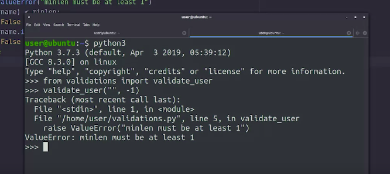</a>
					</p>
					* We imported our function and called it with an invalid parameter
					* Our function successfully raised an error just like we wanted
			* Let's also try calling it with valued parameters to see if those work
					<p align="center">
					  <a href="javascript:void(0)" rel="noopener">
						 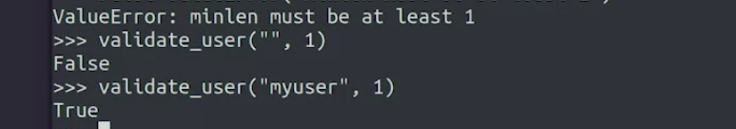</a>
					</p>
					* These are working fine
			* What if instead of passing the string we pass something different as a username to validate
				* First, let's try a number
					```python
					>>> from validations import validate_user
					>>> validate_user(88, 1)
					```
					<p align="center">
					  <a href="javascript:void(0)" rel="noopener">
						 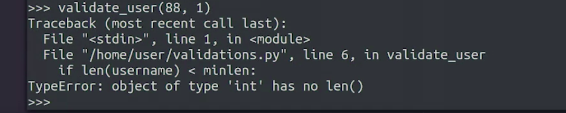</a>
					</p>
					* In this case, the Python interpreter raised an error because our code is trying to use the length function and we can't do that with integers
			* Let's start passing a list which does have a length function
				* First, an empty list
					```python
					>>> from validations import validate_user
					>>> validate_user([], 1)
					```
					<p align="center">
					  <a href="javascript:void(0)" rel="noopener">
						 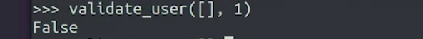</a>
					</p>
					* Because this list is shorter than the minimum length, our code returned false
				* Let's try it with a list of one element
					```python
					>>> from validations import validate_user
					>>> validate_user(['name'], 1)
					```
					<p align="center">
					  <a href="javascript:void(0)" rel="noopener">
						 </a>
					</p>
					* we got a different error because we were trying to use the isalnum method which is not available on list
					* It's usually the responsibility of whoever is calling a function to call it the right parameters
* __assert__ keyword
	* An alternative to the raise keyword that we can use for situations where we want to check that our code behaves the way it should particularly when we want to avoid situations that should never happen
	* __assert__ keyword tries to verify that a conditional expression is true, and if it's false it raises an assertion error with the indicated message
		```python
		>>> def validate_user(username, minlen):
		>>>	# Filename  : validations.py
		>>> 	assert type(username) == str, "username must be a string"
		>>> 	if minlen < 1:
		>>> 		raise ValueError("minlen must be at least 1")
		>>> 	if len(username) < minlen:
		>>> 		return False
		>>> 	if not username.isalnum():
		>>> 		return False
		>>> 	return True
		```
		* We've added an assertion that verifies that the type of the username variable is STR which we know is a name that the interpreter uses for strings
		* If the function is called with a username parameter that's not a string, an error will be raised with the message we provided
		* Lets try the above code
			```python
			>>> from validations import validate_user
			>>> validate_user([3], 1)
			```
			<p align="center">
			  <a href="javascript:void(0)" rel="noopener">
				 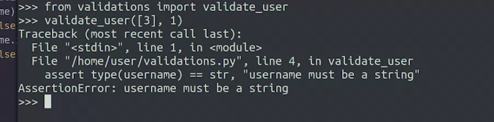</a>
			</p>
			* Our function now raises an error type assertion error if the first parameter isn't a string
	* Assertions can be super helpful for debugging some code that's not behaving the way we expect it to
	* We can add them at any point where we want to ensure that the variables contain the values and types that they should or when we think that's something that shouldn't happen is happening
	* __NOTE:__ __Assertions__ will get removed from our code if we ask the interpreter to optimize it to run faster
	* __NOTE:__ We should use __raise__ to check for conditions that we expect to happen during normal execution of our code and __assert__ to verify situations that aren't expected but that might cause our code to misbehave

### Testing for Expected Errors

* With some edge cases, like negative value of minlen in our earlier example, the expectation is that the function will raise an error and we want to be able to test that too
	* For such cases, We use the __assertRaises()__ method provided by the unit test module
* Existing test suite
	```python
	>>> #!/usr/bin/env python3
	>>>	# Filename  : validations_test.py
	>>> import unittest
	>>> 
	>>> from validations import validate_user
	>>> 
	>>> class TestValidateUser(unittest.TestCase):
	>>> 	def test_valid(self):
	>>> 		self.assertEqual(validate_user('validuser', 3), True)
	>>> 
	>>> 	def test_too_short(self):
	>>> 		self.assertEqual(validate_user('inv', 5), False)
	>>> 
	>>> 	def test_invalid_characters(self):
	>>> 		self.assertEqual(validate_user('invalid_user', 1), False)
	>>> 
	>>> # Run the test
	>>> unittest.main()
	```
	* we've got a few test cases checking that the function is working correctly, when it receives same parameters
	* We now want to add some other cases for when it receives parameters that don't make sense
		* Like a negative value for minlen or a username that's a list instead of the string
			```python
			>>> #!/usr/bin/env python3
			>>>	# Filename  : validations_test.py
			>>> import unittest
			>>> 
			>>> from validations import validate_user
			>>> 
			>>> class TestValidateUser(unittest.TestCase):
			>>> 	def test_valid(self):
			>>> 		self.assertEqual(validate_user('validuser', 3), True)
			>>> 
			>>> 	def test_too_short(self):
			>>> 		self.assertEqual(validate_user('inv', 5), False)
			>>> 
			>>> 	def test_invalid_characters(self):
			>>> 		self.assertEqual(validate_user('invalid_user', 1), False)
			>>>
			>>> def test_invalid_minlen(self):
			>>> 	self.assertRaises(ValueError, validate_user, "user", -1) 
			>>>
			>>> # Run the test
			>>> unittest.main()
			```
			* We can see that the assert raises method works a little bit differently than the assert equal method
			* In this case
				1. we need to first pass the error that we expect the function to raise
				1. Then the function name, followed by any parameters that need to be passed to that function
			* Behind the scenes, this method is calling the function that we want to test using the try except block and checking that it does raise the error that we said it would raise
			* let's run this test suite and verify that our code works correctly
				```python
				>>> ./validations_test.py
				```
				<p align="center">
				  <a href="javascript:void(0)" rel="noopener">
					 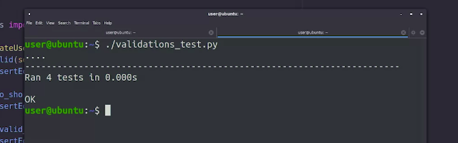</a>
				</p>