Using Python to Interact with the Operating System
==================================================

by Google

# Module 6
#
## Title: Bash Scripting

## Interacting with the Command Line Shell

### Basic Linux Commands

* Some basic linux commands
	1. __echo__ - is a command used to print messages to the screen
	1. __cat__ - is command for showing contents of files
	1. __ls__ - is the command to list contents of a directory
	1. __chmod__ - is a command to change permissions of a file
* A lot of these commands come from Unix
* More linux commands
	1. __mkdir__ - To create a new directory, we use the mkdir command
	1. __cd__ - To change into that directory, we use the cd command
		<p align="center">
		  <a href="javascript:void(0)" rel="noopener">
			 </a>
		</p>
		* These commands don't print anything to the screen
			* A lot of the commands that we'd use don't print anything when they succeed
			* They only print something if they fail
		* To check that the cd command succeeded, we can use a command like pwd to print the current working directory
	1. __pwd__ - pwd to print the current working directory
	1. __cp__ - We can copy files using the cp command
		* For example, we can copy the spider.txt file that we have in the parent directory.
				<p align="center">
				  <a href="javascript:void(0)" rel="noopener">
					 </a>
				</p>
			* Dots are shortcuts that we can use to refer to some special directories
				* the dot-dot (`..`) shortcut reverses a parent directory, the previous directory and the absolute path
				* the dot (`.`) shortcut reverses the current directory
			* So this command is copying the spider.txt file located in the previous directory to this directory.
	1. __touch__ - We can also create an empty file using the touch command
				<p align="center">
				  <a href="javascript:void(0)" rel="noopener">
					 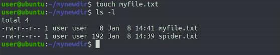</a>
				</p>
	1. __ls__ - __ls__ command list the names of the files contained in directory
		1. __ls -l__ - the ls command using the __dash l__ or `-l` command line argument
			* __Remember__, command-line arguments let us change the behavior of commands making them do what we want
			* By passing the dash l, we get a lot of extra information distributed in a bunch of columns
					<p align="center">
					  <a href="javascript:void(0)" rel="noopener">
						 </a>
					</p>
				* What are these columns?
					1. The first column indicates the permissions of the file
					1. The second column is the number of i nodes that point to the file
					1. The third and fourth columns indicate the owner and the group to which the file belongs
					1. Then comes the size of the file that they've less modification
					1. finally, the name
				* In our case, we have the file that we copied which has 192 bytes and another file that we created, using the touch command, which has zero bytes
		1. __ls -la__
			* The dash eighth lag shows hidden files which are the ones that start with a dot
					<p align="center">
					  <a href="javascript:void(0)" rel="noopener">
						 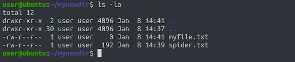</a>
					</p>
				* The dot shortcut, for the current directory, and a dot dot shortcut for the parent directory
				* The sizes of these directories are related to the amount of files in them
	1. __mv__ - To rename or move a file, we use the mv command
					<p align="center">
					  <a href="javascript:void(0)" rel="noopener">
						 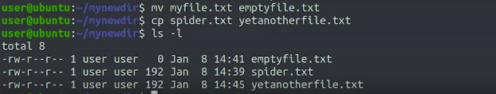</a>
					</p>
		* We've now renamed myfile.txt to emptyfile.txt and created a new copy of the spider.txt file
		* Each of these commands use the same format
			* The first parameter is the old file and the second parameter is a new file
		* the empty file is now called emptyfile.txt
	1. __rm__ - To delete these files, we can use a rm command
		* We can either go one-by-one or we delete them all together using the star (`*`)
					<p align="center">
					  <a href="javascript:void(0)" rel="noopener">
						 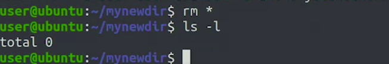</a>
					</p>
		* The star is a placeholder that gets swapped out by the names of all the files in our directory
		* Steps to remove our current working directory
			1. First, we need to change to the previous directory
				* using `cd ../`
					* dot-dot is a way we use to identify whatever was the previous directory
			1. Now we can delete the directory using __rmdir__
				* This command only works on empty directories so I wouldn't work if we had left any files in it
					<p align="center">
					  <a href="javascript:void(0)" rel="noopener">
						 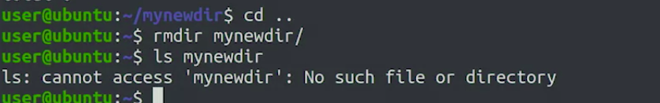</a>
					</p>
				* When calling the ls command, we pass the name of the directory that we want to list and got back an error because the directory didn't exist anymore

### Redirecting Streams

* By default, the input is provided by the keyboard at the text terminal and the output and error are shown on the screen
	* This is the case not only for our Python scripts, but for all system commands
* We can change this default using the process called __redirection__
* __Redirection__ is a process of sending a stream to a different destination
	* This process is provided to us by the operating system
		* Can be really useful when you want to store the output of a command in a file, instead of just looking at it on a screen
	* To __redirect the standard output__ of a program to a file we use the __greater than__ (`>`) symbol
		* For example
			* Take the following Python program, which just prints a single line of text using the print function
				```python
				>>> #!/usr/bin/env python
				>>> # Filename : stdout_example.py
				>>> print("Don't mind me, just a bit of text here...")
				```
				* If we run this program without redirection the text will be sent to the display using the STD out normally
				* But if we use a greater than character to redirect the output 
						<p align="center">
						  <a href="javascript:void(0)" rel="noopener">
							 </a>
						</p>
					* When you run it this way the STD out from stdout_example.py script is redirected to a file called new_file.txt
						* If that file doesn't exist, it's created
					* Let's look at the contents new_file.txt using the __cat__ command
							<p align="center">
							  <a href="javascript:void(0)" rel="noopener">
								 </a>
							</p>
						* The output of our program ended up in the file that we wrote after the greater than symbol
					* If we want to append the redirected standard out to a file we can use the __double greater than sign__ (`>>`) instead of __single greater than__ (`>`)
							<p align="center">
							  <a href="javascript:void(0)" rel="noopener">
								 </a>
							</p>
		* __NOTE:__ Each time we perform of redirection of STD out, the destination is overwritten
			* Just like the __w file mode__ used by the __open()__ function
			* So we need to be super careful when using this redirection that we're not overwriting a file with valuable contents
	* __We can also redirect standard input or STDIN__
		* Instead of using the keyboard to send data into a program, we can use the less than symbol to read the contents of a file
		* Let's try this out with a new version of the streams.py file
			```python
			>>> #!/usr/bin/env python
			>>> # Filename : streams_err.py
			>>> data = input('This will come from STDIN: ')
			>>> print('Now we write it to STDOUT: ' + data)
			>>> raise ValueError('Now we generate an error to STDERR')
			```
			<p align="center">
			  <a href="javascript:void(0)" rel="noopener">
				 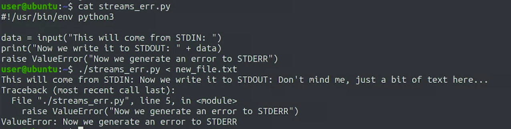</a>
			</p>
			* In this case, we don't see the input on the screen in the STDIN portion
				* This is expected because the input was read from a file
			* So it only appears in the STDOUT portion where we see that it read one of the two lines
				* This is also expected because the input function only reads until it encounters a new line character
	* __We can also redirect standard error or STDERR__
		* It can also be useful to redirect STD_err or to capture errors and diagnostic messages from a program
			* This can be done by using the character combination __`2>`__ than similar to how we redirected STDOUT
		* Let's execute our stream example again, this time redirecting the err output to a separate file
					<p align="center">
					  <a href="javascript:void(0)" rel="noopener">
						 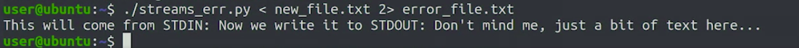</a>
					</p>
			* This time we don't see the error message on the screen
				* That's because we redirected it to the error file
					<p align="center">
					  <a href="javascript:void(0)" rel="noopener">
						 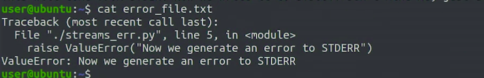</a>
					</p>
				* If you're wondering about the number `2`, it represents the file descriptor of the STDERR stream
					* In this context you can think of a file descriptor as a kind of variable pointing to an IO resource
						* In this case the STDERR stream
				* `0` and `1` are the file descriptors for STDIN and STDOUT
	* __NOTE:__ None of this is exclusive the python we can operate in the same way with all other commands
		* For Example
			* We can create a file using the echo command and redirecting its output to the file that we want to create
						<p align="center">
						  <a href="javascript:void(0)" rel="noopener">
							 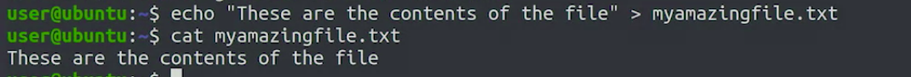</a>
						</p>

### Pipes and Pipelines

* Other than redirection, there's another powerful way to perform IO stream redirection called __Piping__
* Using __pipes__, you can connect multiple scripts, commands, or other programs together into a __data processing pipeline__
* __Pipes__ connect the output of one program to the input of another
	* This means we can pass data between programs, taking the output of one and making it the input of the next
* __Pipes__ are represented by the __pipe character__ (`|`)
* Using __pipes__ is an extremely useful tool
	* It allows us to create new commands by combining the functionality of one command, with the functionality of another without having to store the contents in an intermediate file
* Example
	1. Here, the output of the ls-l command is connected to the input of the less command, which is a terminal paging program
		```shell
		>>> ls -l | less
		```
		<p align="center">
		  <a href="javascript:void(0)" rel="noopener">
			 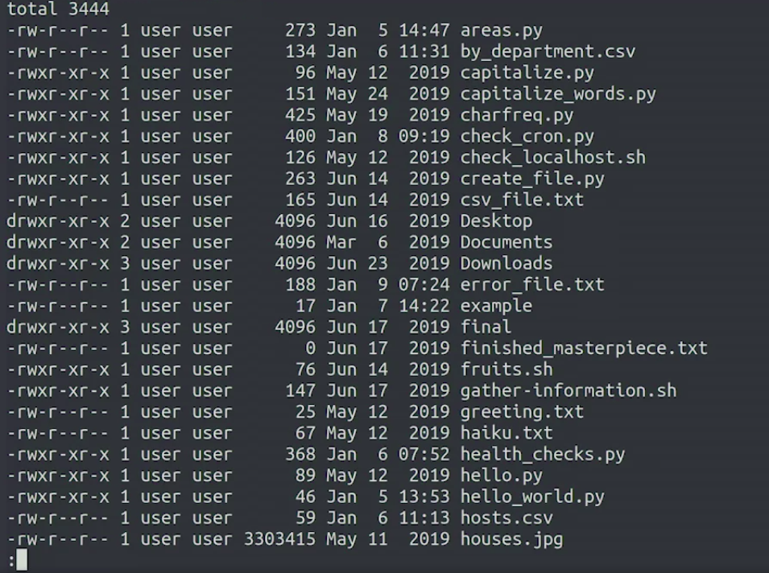</a>
		</p>
		* This example can be pretty useful when you want to look at the contents of a directory containing lots of files
		* The list of files generated by ls is piped to less, which displays them one page at a time
			* We can scroll up or down using the page up, page down, or arrow keys
		* Once we're done looking at the files, we can quit with __q__
	1. It's possible to connect a lot more than just two programs using pipes
		```shell
		>>> cat spider.txt | tr ' ' '\n' | sort | uniq -c | sort -nr | head
		```
		<p align="center">
		  <a href="javascript:void(0)" rel="noopener">
			 </a>
		</p>
		* We're first using cat to get the contents of our spider.txt file
		* Those contents are then sent to a command called tr, which gets its name from the word translate
			* It takes the characters in the first parameter, in this case, it's a space ' ' and then transform them into a character in the second parameter, in this case, it's a newline character `\n`
			* So basically, what we're doing is putting each word in its own separate line
		* Next, we pass results to the sort command through a pipe
			* This command sorts results alphabetically
		* The sorted results are then passed to the unique command
			* which displays each match once, and by using a -c flag, it prefixes each unique line with a number of times it occurred
		* This output is passed via pipe to the sort command once more, this time, with the -nr flag
			* which sorts results numerically and in reverse order, from most to least hits
		* The output is finally passed to the head command, which prints the first 10 lines to STDOUT
* We can use python scripts in pipelines too
	* Python can read from standard input using the __stdin file object__ provided by the __sys module__
	* Example
		* Let's say we want to write a script that reads each line of the input and then prints a line with the first character in uppercase
			```python
			>>> #!/usr/bin/env python
			>>> # Filename : capitalize.py
			>>> import sys
			>>> 
			>>> for line in sys.stdin:
			>>> 	print(line.strip().capitalize())
			```
			* In this script, we're iterating over the contents of the sys.stdin file
			* __Remember__, that when we iterate a file object, we go through it line by line
			* What it does
				* For each of the lines of a file, we first use the strip method to remove the newline character at the end
				* then capitalize method to make the first character of the line uppercase
				* then we print it out to standard output or STDOUT
			* Output of the script on execution
				```shell
				>>> cat haiku.txt | ./capitalize.py
				```
				<p align="center">
				  <a href="javascript:void(0)" rel="noopener">
					 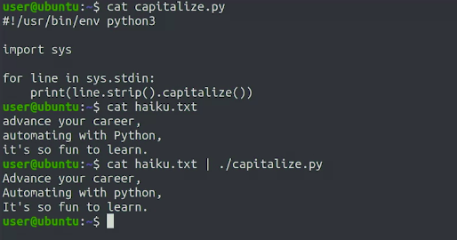</a>
				</p>
				* The cat command sends the contents of a Haiku.txt file to standard output, which we redirect to our script using a pipe
				* Our capitalized script uses the sys stdin file object to iterate through each line of standard input, printing the capitalized version to standard output
			* We don't need to use a pipe to get the contents of the Haiku.txt file into standard input of our script
				* Instead, we can also use the redirection operator
					```shell
					>>> ./capitalize.py < haiku.txt
					```
					<p align="center">
					  <a href="javascript:void(0)" rel="noopener">
						 </a>
					</p>

### Signalling Processes

* __Signals__ are tokens delivered to running processes to indicate a desired action
* Using __signals__, we can tell a program that we want it to __pause__ or __terminate__
	* We can also cause it to __reload its configuration__, or to __close all open files__
* Knowing how to send these signals lets us interact with processes and have more control over how they behave
* Different ways that we can send these signals
	* For Example
		1. let's execute the ping command in our terminal
			* The ping command is now running, sending ICMP packets to machine over the network once per second
			* And it will keep running forever unless we interrupt it
				* To do that, we can use the Ctrl-C combination
						<p align="center">
						  <a href="javascript:void(0)" rel="noopener">
							 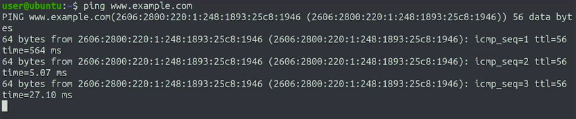</a>
						</p>
			* When we interrupt it, the program doesn't just end abruptly
				* First it prints a summary of what it did and what the results were
						<p align="center">
						  <a href="javascript:void(0)" rel="noopener">
							 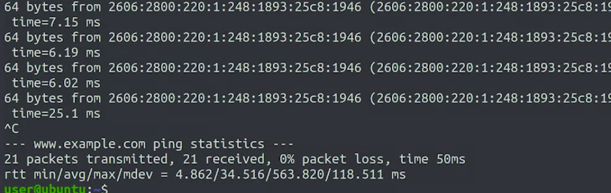</a>
						</p>
				* What's happening behind the scenes is the process received a signal indicating that we wanted it to stop
					* When that signal's received, the process does whatever it needs to finish cleanly
				* The signal that control see sense is called __SIGINT__
					* It's just one of many signals that we can send
			* Another keyboard combination that we can use to send a signal is Ctrl-Z
						<p align="center">
						  <a href="javascript:void(0)" rel="noopener">
							 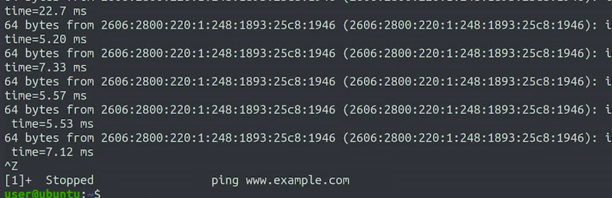</a>
						</p>
				* This time the process didn't finish properly. We get a message saying that it's stopped
				* The signal that we sent is called __SIGSTOP__
					* This signal causes the program to stop running without actually terminating
				* We can make it run again by executing __fg__ command
					* The __fg__ command makes our program run once more and will keep going until we interrupt it either with Ctrl-C, Ctrl-Z, or some other signal
						<p align="center">
						  <a href="javascript:void(0)" rel="noopener">
							 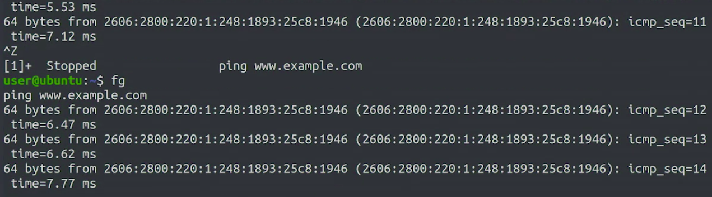</a>
						</p>
* To send other signals, we can use the command called __Kill__
	* By __default__, __Kill__ will send a signal called __SIGTERM__ that tells the program to terminate
	* Since Kill is a separate program, we need to run it on a separate terminal
		* And we also need to know the process identifier or PID of the process that we want to send the signal to
	* To find out the PID that we want to send the signal to, we'll use the __ps command__ which list the currently running processes
		* Depending on what options that we pass, it'll show different subsets of processes with different amounts of detail
		* For this example, we'll call __ps ax__, which lists all the running processes in the current computer
			* And then we'll use the __grep__ command to only keep lines that contain the name of the process that we're looking for
			* We'll run ping on one terminal, and then find its PID and kill it from a second terminal
						<p align="center">
						  <a href="javascript:void(0)" rel="noopener">
							 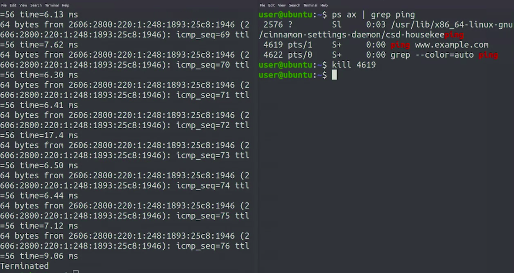</a>
						</p>
				* We've now sent the __SIGTERM__ signal and the process was __terminated__

### Basic Linux Commands Cheat-Sheet

* This list includes a bunch of different commands that are useful to know when working with Linux
	1. Managing files and directories
		* __cd__ directory: changes the current working directory to the specified one
		* __pwd__: prints the current working directory
		* __ls__: lists the contents of the current directory
		* __ls__ directory: lists the contents of the received directory
		* __ls__ -l: lists the additional information for the contents of the directory
		* __ls__ -a: lists all files, including those hidden
		* __ls__ -la: applies both the -l and the -a flags
		* __mkdir__ directory: creates the directory with the received name
		* __rmdir__ directory: deletes the directory with the received name (if empty)
		* __cp__ old_name new_name: copies old_name into new_name
		* __mv__ old_name new_name: moves old_name into new_name
		* __touch__ file_name: creates an empty file or updates the modified time if it exists
		* __chmod__ modifiers files: changes the permissions for the files according to the provided modifiers; we've seen +x to make the file executable
		* __chown__ user files: changes the owner of the files to the given user
		* __chgrp__ group files: changes the group of the files to the given group
	1. Operating with the content of files
		* __cat__ file: shows the content of the file through standard output
		* __wc__ file: counts the amount of characters, words, and lines in the given file; can also count the same values of whatever it receives via stdin
		* __file__ file: prints the type of the given file, as recognized by the operating system
		* __head__ file: shows the first 10 lines of the given file
		* __tail__ file: shows the last 10 lines of the given file
		* __less__ file: scrolls through the contents of the given file (press "q" to quit)
		* __sort__ file: sorts the lines of the file alphabetically
		* __cut__ **-d**separator **-f**fields file: for each line in the given file, splits the line according to the given separator and prints the given fields (starting from 1)
	1. Additional commands
		* __echo__ "message": prints the message to standard output
		* __date__ : prints the current date
		* __who__ : prints the list of users currently logged into the computer
		* __man__ command: shows the manual page of the given command; manual pages contain a lot of information explaining how to use each command (press "q" to quit)
		* __uptime__ : shows how long the computer has been running
		* __free__ : shows the amount of unused memory on the current system

### Redirections, Pipes and Signals

* Managing streams
	* These are the redirectors that we can use to take control of the streams of our programs
		* command __>__ file: redirects standard output, overwrites file
		* command __>>__ file: redirects standard output, appends to file
		* command __<__ file: redirects standard input from file
		* command __2>__ file: redirects standard error to file
		* command1 __|__ command2: connects the output of command1 to the input of command2
* Operating with processes
	* These are some commands that are useful to know in Linux when interacting with processes
		* **ps**: lists the processes executing in the current terminal for the current user
		* **ps** ax: lists all processes currently executing for all users
		* **ps** e: shows the environment for the processes listed
		* **kill** PID: sends the SIGTERM signal to the process identified by PID
		* **fg**: causes a job that was stopped or in the background to return to the foreground
		* **bg**: causes a job that was stopped to go to the background
		* **jobs**: lists the jobs currently running or stopped
		* **top**: shows the processes currently using the most CPU time (press "q" to quit)

## Bash Scripting

### Creating Bash Scripts

* __Bash__ is the most commonly used shell on Linux.
* __Bash__ is not only the interpreter that runs our commands, it's also a scripting language
	* We can use Bash to write simple scripts when we need to use a lot of commands
* Some commands which can help you in debug process for your scripts
	* the ps command can list all the current running processes
	* The free command can show you the amount of free memory
	* The uptime command can tell you how long the computer has been on
* Anytime you need to debug a computer, you can manually run these commands one by one, followed by as many commands as you can think of that might be helpful
* Or, we can create a Bash script which can execute all the required commands one after the another
* Example
	* Let's start with a simple version of a script which will execute all the required commands one after the another
	* The script we're seeing here is calling three main commands, uptime, free, and who, which lists users currently logged into the computer
		```shell
		>>> #!/bin/bash
		>>> # Filename : gather-information.sh
		>>>
		>>> echo "Starting time at: $(date)"
		>>> echo
		>>>
		>>> echo "UPTIME"
		>>> uptime
		>>> echo
		>>>
		>>> echo "FREE"
		>>> free
		>>> echo
		>>> 
		>>> echo "WHO"
		>>> who
		>>> echo
		>>> 
		>>> echo "Finshing at: $(date)"
		```
		* It uses the echo command to print some other information and to make the output a bit more readable by leaving empty lines between the commands
		* We're also calling the date command to print the current date
		* To call this command, we're using a special notation by putting the command inside __dollar sign parentheses__
			* This indicates that the output of the command should be passed to the echo command and be printed to the screen
				```shell
				>>> ./gather-information.sh
				```
				<p align="center">
				  <a href="javascript:void(0)" rel="noopener">
					 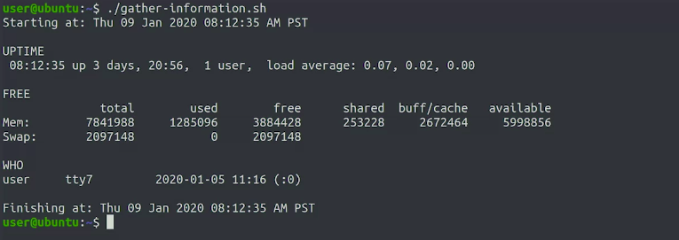</a>
				</p>
				* The starting and finishing times are the same because there are so few operations we're doing that it takes a computer less than a second to complete them
		* We could also write the commands on the same line using semicolons to separate them
			```shell
			>>> #!/bin/bash
			>>> # Filename : gather-information.sh
			>>>
			>>> echo "Starting time at: $(date)"; echo
			>>> 
			>>> echo "UPTIME"; uptime; echo
			>>> 
			>>> echo "FREE"; free; echo
			>>> 
			>>> echo "WHO"; who; echo
			>>> 
			>>> echo "Finshing at: $(date)"
			```
			<p align="center">
			  <a href="javascript:void(0)" rel="noopener">
				 </a>
			</p>

### Using Variables and Globs

* __Bash__ is a fully powered scripting language, not just a way of executing commands one after the other
	* We can assign variables, new conditional operations, execute loops, defined functions, and so much more
* __Variables__
	* Much like Python, bash lets us use variables to store and retrieve values
	* __Environment Variables__ - These are variables that are set in the environment in which the command is executing
	* we set these variables using the equals sign
	* When we want __to access the value of a variable__ in bash, we need to prefix the name of the variable with the __dollar sign__
	* On top of the predefined environment variables, we can also define our own variables for our scripts
		* To do that we just assign a value to the name of the variable that we want to define
			```shell
			>>> example=hello
			>>> echo $example
				hello
			```
			* __NOTE:__ There can be no spaces between the name of the variable and the equal sign, or between the equal sign and the value
			* If we try to define a variable and leave a space at one side or the other, the show will complain that it can't find the command with the name that we're assigning
				```shell
				>>> example = hello
				```
				<p align="center">
				  <a href="javascript:void(0)" rel="noopener">
					 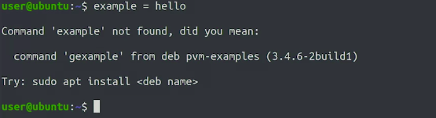</a>
				</p>
				* __Remember__ that any variable that you define in your script or in the command line is local to the environment where you define it
			* If you want commands from that environment to also see the variable you need to export them using the __export keyword__
	* We need to modify gather-information.sh script and add a variable to it
		* We'll use that variable to make our script look nicer by adding lines in between each of the commands
			```shell
			>>> #!/bin/bash
			>>> # Filename : gather-information.sh
			>>> 
			>>> line="-------------------------------------------------------------------"
			>>> 
			>>> echo "Starting time at: $(date)"; echo $line
			>>> 
			>>> echo "UPTIME"; uptime; echo $line
			>>> 
			>>> echo "FREE"; free; echo $line
			>>> 
			>>> echo "WHO"; who; echo $line
			>>> 
			>>> echo "Finshing at: $(date)"
			```
			* Output of the script on executing
				```shell
				>>> ./gather-information.sh
				```
				<p align="center">
				  <a href="javascript:void(0)" rel="noopener">
					 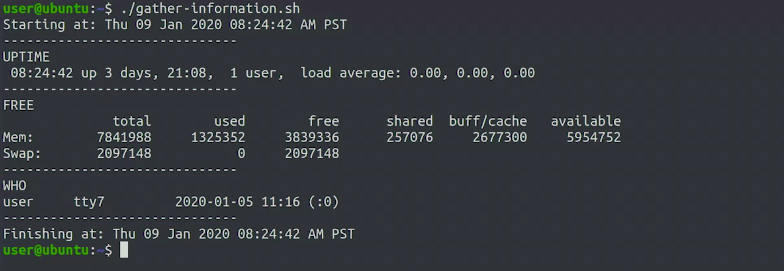</a>
				</p>
* __GLOBS__
	* __Globs__ are characters that allow us to create list of files
	* The __star__ (`*`) and __question mark__ (`?`) are the most common globs
	* Using these globs lets us create sequences of filenames that we can use as parameters to the commands we call in our scripts
	* In bash, using a __star__ in the command line we'll match all filenames that follow the format that we specify
		* For example
			* When we write `*.py`, the shell turns it into a list containing all the filenames to end with py in the current directory
				```shell
				>>> echo *.py
				```
				<p align="center">
				  <a href="javascript:void(0)" rel="noopener">
					 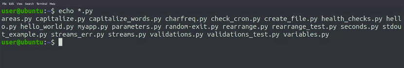</a>
				</p>
			* We can also put the star at the end of an expression to get the list of all files that start with a certain prefix
				```shell
				>>> echo c*
				```
				<p align="center">
				  <a href="javascript:void(0)" rel="noopener">
					 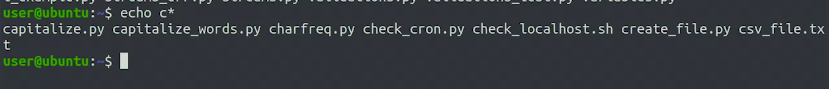</a>
				</p>
				* In this case, we get all the files in the current directory that start with the letter 'c'
			* We can also use a star with no prefix or suffix which would match all the files in the current directory
				```shell
				>>> echo *
				```
				<p align="center">
				  <a href="javascript:void(0)" rel="noopener">
					 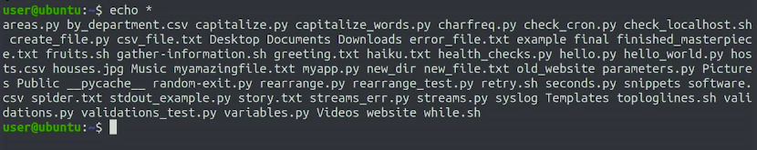</a>
				</p>
	* The question mark symbol can be used to match exactly one character instead of any amount of characters, and we can repeat it as many times as we need
		* For Example
			* We can get the Python files with five characters in their name by using the five question marks together
				```shell
				>>> echo ?????.py
				```
				<p align="center">
				  <a href="javascript:void(0)" rel="noopener">
					 </a>
				</p>
	* __NOTE:__ If you want to use this functionality in Python, it's available through the __glob module__

### Conditional Execution in Bash

* One of the main concepts of programming is being able to branch the execution according to a condition
	* In other words, making our program behave in different ways depending on one or more values
	* In Python, we use the if block and the condition is an expression that has to evaluate to true or false
	* In bash scripting, the condition used is based on the __exit status of commands__
* In bash scripting an exit value of zero means success
	* This logic is used by the if operator in bash
* To create a conditional expression, we're going to call a command and if the exit status of that command is zero, then the condition will be considered true
* Example
	1. Say we wanted to verify that the /etc/hosts file contains an entry for 127.0.0.1, which it should
		* Knowing that grep will return it exit status of zero when it finds at least one match and different than zero if it doesn't find a match, we can use it to do this verification
			```shell
			>>> #!/bin/bash
			>>> # Filename : check-localhost.sh
			>>> 
			>>> if grep "127.0.0.1" /etc/hosts; then
			>>>     echo "Everything ok"
			>>> else
			>>>     echo "ERROR! 127.0.0.1 is not in /etc/hosts"
			>>> fi
			```
			* We start with the __if__ keyword followed by the grep command that we'll use to check for success
			* At the end of the command, we have a semicolon followed by the word then
			* After that comes the body of the conditional
			* And finally, our conditional block finishes using the __fi__ keyword
			* Output of the script
				```shell
				>>> ./check-localhost.sh
				```
				<p align="center">
				  <a href="javascript:void(0)" rel="noopener">
					 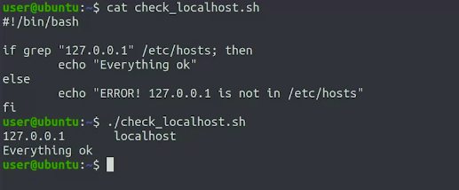</a>
				</p>
				* The first line in the output is the one generated by our grep command, because by default, grep prints the lines that match the expression that we give it
				* The second line in the output is the one that was generated by our script
					* So in this case, the grep command called by our script found a line in the file and exited with a value of zero
					* So our script said that everything was okay
* __test__ command
	* To help us with evaluating conditions, there is a command called __test__
	* __Test__ is a command that evaluates the conditions received and exits with zero when they are true and with one when they're false
	* Example
		1. test example 1
			```shell
			>>> if test -n "$PATH"; then echo "Your path is not empty"; fi
			```
			<p align="center">
			  <a href="javascript:void(0)" rel="noopener">
				 </a>
			</p>
			* We're using the -n option for the test command, which checks if a string variable is empty or not
		1. Another way to write __text__ command
			```shell
			>>> if [ -n "$PATH" ]; then echo "Your path is not empty"; fi
			```
			<p align="center">
			  <a href="javascript:void(0)" rel="noopener">
				 </a>
			</p>
			* In this case, the command we're calling is the opening square bracket
				* This is an alias to the test command, but to call it successfully, we also need to include a closing square bracket
			* __NOTE:__ When using this syntax, remember, that there needs to be a space before the closing bracket

> Using indentation like in Python. This is a good style choice, and it makes the code more readable. But it's not mandatory in Bash
#
> It's possible to write this in one line and sometimes we might do that when the amount of code is small enough
#
> In general, though, it's nice to have bash commands in separate lines and use indentation to clearly show the body of the conditional


## Advanced Bash Concepts

### While Loops in Bash Scripts

* Bash provides similar looping structures to Python
	* We can iterate while a condition is true using a __while loop__ and iterate over a list of elements using a __for loop__
* __Loops__ are what makes the computer do repetitive tasks for us, anything from working with a bunch of numbers to processing the contents of a file line by line
* Example
	1. In this script, we're using the variable N to print messages, counting from one to five
		* The condition for the while loop uses the same format as a condition for an if block
		* In this example, we check if the variable N is less than or equal to five using the `-le` operator
			```shell
			>>> #!/bin/bash
			>>> # Filename : while.sh
			>>> 
			>>> n=1
			>>> while [ $n -le 5 ]; do
			>>>     echo "Iteration number $n"
			>>>     ((n+=1))
			>>> done
			```
			* The loop itself starts with the do keyword and finishes with a done keyword
			* To increment the value of the variable N, we're using a bash construct of double parentheses that lets us do arithmetic operations with our variables
			* Lets execute the script
				```shell
				>>> ./while.sh
				```
				<p align="center">
				  <a href="javascript:void(0)" rel="noopener">
					 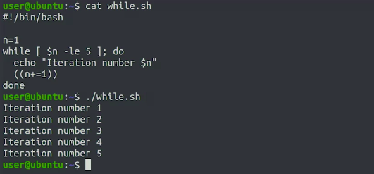</a>
				</p>
* When using while loops and bash scripts, it's common to have a loop that retries a command a number of times until it succeeds
	* This is really useful with commands that use network connections or that access resources that might be locked
	* These commands can fail for external reasons and they're likely to succeed after a retry or two
	* To simulate a command that sometimes succeeds or sometimes fails, we have a small Python script that will return an exit value picked at random by a range that we give it
		```python
		>>> #!/usr/bin/env python
		>>> # Filename : random-exit.py
		>>> 
		>>> import sys
		>>> import random
		>>> 
		>>> # Uses random randint to generate a value between zero and three
		>>> value=random.randint(0, 3)
		>>> # Prints the selected value and exits with it
		>>> print("Returning: " + str(value))
		>>> sys.exit(value)
		```
		* It uses random rand int to generate a value between zero and three, then it prints the selected value and exits with it
		* Lets execute the script and check the output
			```shell
			>>> ./random-exit.py
				Returning: 1
			>>> ./random-exit.py
				Returning: 2
			>>> ./random-exit.py
				Returning: 3
			```
			* So we see that we get a value in the zero to three range
			* Which value we get will depend on each call
	* We want to simulate a command that sometimes fails and sometimes succeeds
	* let's have a look at our Bash script that will retry the command
		```shell
		>>> #!/bin/bash
		>>> # Filename : retry.sh
		>>> 
		>>> n=0
		>>> command=$1
		>>> while ! $command && [ $n -le 5 ]; do
		>>> 	sleep $n
		>>> 	((n=n+1))
		>>> 	echo "Retry #$n"
		>>> done;
		```
		* One interesting thing is that we're getting the value of a command line argument using the `$1`, this is what we use in Bash to access the first command line argument
			* In Python, we get the same information using `sys.argv[1]`
		* So we store the parameter and the variable called command, and then we execute the while loop until either the command succeeds or the end variable reaches a value of five
			* In other words, if the received command fails, we'll retry up to five times
		* In the body of the while loop, we first sleep a few seconds, then increment the variable and print the number of free try attempts
		* why do we call the sleep command?
			* the idea here is that if the command we're calling is failing due to CPU usage, network or resource exhaustion, it might make sense to wait a bit before trying again
		* To try this out, we'll need to call our retry script with the random exit command as a parameter
			```shell
			>>> ./retry.sh ./random-exit.py
				Returning: 1
				Retry #1
				Returning: 3
				Retry #2
				Returning: 1
				Retry #3
				Returning: 0
			```
			* We can see how our script keeps executing until the command that we passed returns zero which is exactly what we wanted, zero problems

### For Loops in Bash Scripts

* Both in Python and Bash, for loops are used to iterate over a sequence of elements
* The key to for loops is that they let us perform an operation on each of the elements in a sequence
* In Python, the sequences are data structures like a list or a tuple or a string
	* In Bash, we construct these sequences just by listing the elements with spaces in between
* Example
	1. In this case, we're iterating over three different elements that have the names of fruits
		```shell
		>>> #!/bin/bash
		>>> # Filename : fruits.sh
		>>> 
		>>> for fruit in peach orange apple; do
		>>> 	echo "I like $fruit!"
		>>> done
		```
		* Lets execute the script and check the output
			```shell
			>>> ./fruits.sh
			```
			<p align="center">
			  <a href="javascript:void(0)" rel="noopener">
				 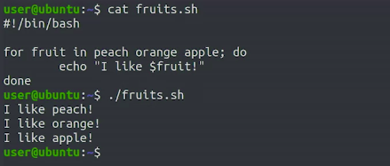</a>
			</p>
* in Bash, we can use globs like star and question mark to create lists of files
	* These lists are separated by spaces and so we can use them in our loops to iterate over a list of files that match a criteria, like all the files that end in __.pdf__, all files that start with __img__ or whatever it is that we need
	* Example
		1. Imagine that you're migrating your company's website from one web server software to another
			* Your web content is stored in a bunch of files that all end in uppercase HTM, and the new software requires that they all end in lowercase HTML
			* We have 5 files that we need to rename
						<p align="center">
						  <a href="javascript:void(0)" rel="noopener">
							 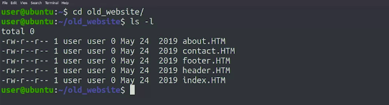</a>
						</p>
				* __basename__ command that can help us to extract the part before the extension
					* This command takes a filename and an extension and then returns the name without the extension
						* Our script we'll iterate with a for loop through all the files that end with '.HTM'
						* Now for each file we want to call basename to keep the part of the file that we care about
							* We'll store that in a variable called name
						* We'll use __dollar sign__ parentheses to call the command and keep the output
						* We're surrounding our file variable with double-quotes to allow the command to work even if the file has spaces in its name
							* This is a good practice in Bash scripts when dealing with file names or any variables that could include spaces
						* Now, we'll call the __mv command__ with the old and new names
							* In this case, we use double quotes for both parameters
							* Again, we want to make sure that it works correctly for file names with spaces
						* We'll finish our loop of the __done__ keyword
							```shell
							>>> #!/bin/bash
							>>> # Filename : rename.sh
							>>> 
							>>> for file in *.HTM; do
							>>> 	name=$(basename "$file" .HTM)
							>>> 	echo mv "$file" "$name.html"
							>>> done
							```
							* We'll add an echo in front of the __mv command__
								* This means that instead of actually renaming, our script we'll print the renaming that it plans to do
								* This will prevent script from making any changes in file system if in case there is any bug in the code
						* Lets execute the script and check the output
							```shell
							>>> chmod +x rename.sh
							>>>
							>>> ./rename.sh
							```
							<p align="center">
							  <a href="javascript:void(0)" rel="noopener">
								 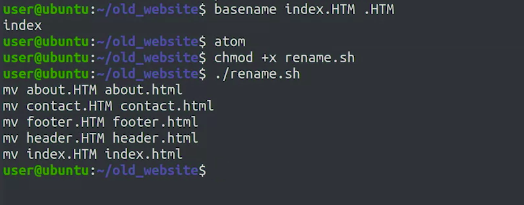</a>
							</p>
						* Output of same script after removing 'echo' which we placed in front of 'mv' command
								<p align="center">
								  <a href="javascript:void(0)" rel="noopener">
									 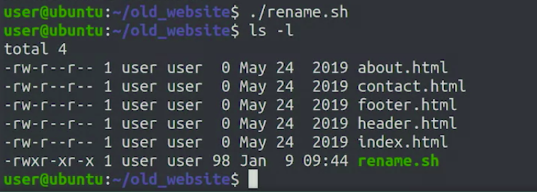</a>
								</p>

### Advanced Command Interaction

* The system log file located in `var/log/syslog`
* The system log file contains a trove of information about what's going on in the system
* Let's use the tail command to look at the last 10 lines from the file right now
	* The load lines we see follow a similar pattern
		* First, they include the date and time of when the entry was added to the file
		* then the name of the computer
		* then the name and PID of the process that trigger the event
		* finally, the actual event that's being logged
	* Example
		* Say that we had a computer that was under significant load but we didn't know why, and to find out we wanted to check what events are being logged the most or Syslog
			* To do that we need to extract the part of the line that has the actual event without the date and time
			* We can use a command called cut to help us with that
			* In this example, we can split the line using spaces
				```shell
				>>> tail /var/log/syslog | cut -d' ' -f5-
				```
				<p align="center">
				  <a href="javascript:void(0)" rel="noopener">
					 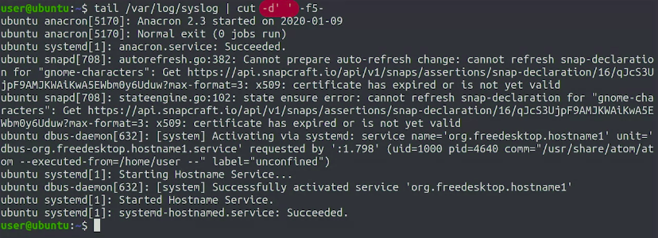</a>
				</p>
			* In our example, we're passing __dash d space__ (`-d' '`) to cut to tell it that we want to use a space as a delimiter
				* __dash f5 dash__ (`-f5-`) that tell it that we want to print the field number 5 and everything that comes after it
				* With that, we remove the date and the name of the computer keeping only the process and the event message
			* Now that we have the information that we care about, we can pipe this to the same pipeline of commands that we saw in an earlier video to find out the lines that are repeated the most
				```shell
				>>> cut -d' ' -f5- /var/log/syslog | sort | uniq -c | sort -nr | head
				```
				<p align="center">
				  <a href="javascript:void(0)" rel="noopener">
					 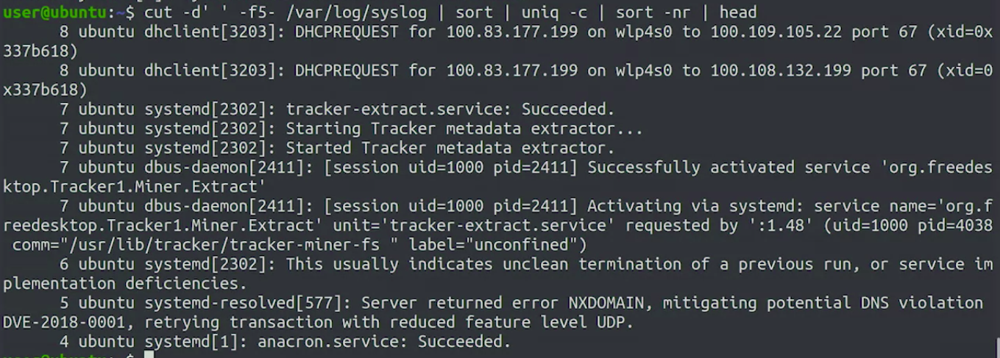</a>
				</p>
			* we've chained together a bunch of commands so that we get the most repetitive lines in our __syslog file__
			* So we can use a for loop to iterate over each of the log files in `var/log` and get the most repeated lines in each of them
			* Bash script to get most repetitives lines in syslogs
				* In this script we process all files in `var/log` that end in log
				* We then print the name of the file that we're processing and then use the same group of commands as before to print the top five lines in each file
					```shell
					>>> #!/bin/bash
					>>> # Filename : toploglines.sh
					>>> 
					>>> for logfile in /var/log/*log; do
					>>> 	echo "Processing: $logfile"
					>>> 	cut -d' ' -f5- $logfile | sort | uniq -c | sort -nr | head -5
					>>> done
					```
					<p align="center">
					  <a href="javascript:void(0)" rel="noopener">
						 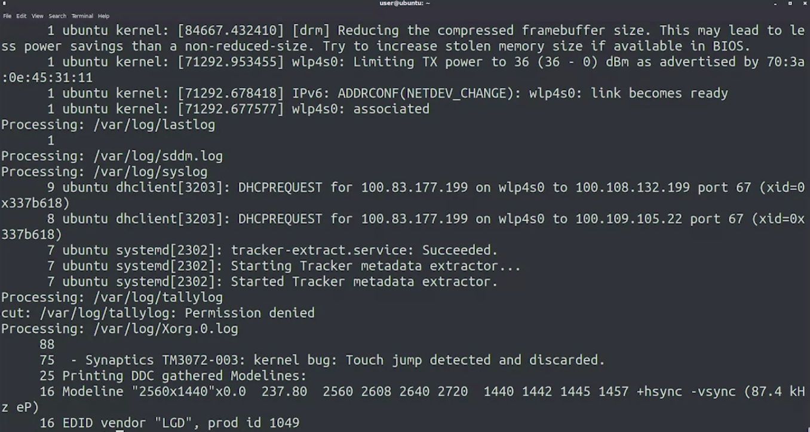</a>
					</p>
* __cut__ command
	* This command, let's us take only bits of each line using a field delimiter

### Choosing Between Bash and Python

* By using bash scripts, we can very quickly turn a command that operates on just one file into an automated script that handles 1,000 files
* Bash scripts aren't as flexible or robust as having entire Python language available, with its many functions to operate on strings, lists, and dictionaries
							<p align="center">
							  <a href="javascript:void(0)" rel="noopener">
								 </a>
							</p> 
* NO MORE NOTES . NOTHING IMPORTANT TO WRITE DOWN

